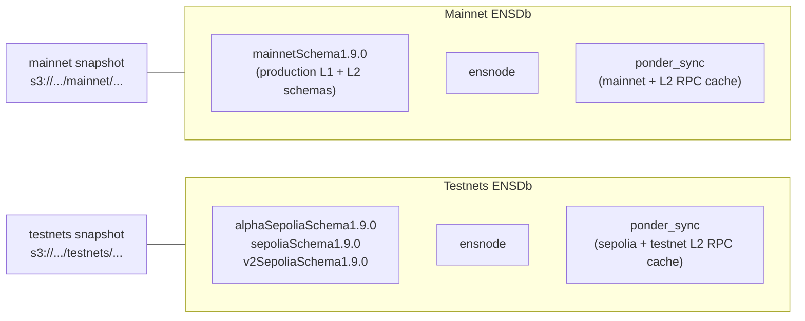

# ENSDb CLI Tool

## Context

ENSNode production databases are large PostgreSQL instances. Each chain deployment gets its own indexer schema following the naming convention `{deployment}Schema{version}`. Three schema types coexist within a single ENSDb:

- **Indexer schemas** (one per deployment, named via `ENSINDEXER_SCHEMA_NAME`): e.g. `mainnetSchema1.9.0`, `sepoliaSchema1.9.0`.
- **`ensnode`** -- application schema containing `metadata` (rows scoped by `ens_indexer_schema_name`) and `__drizzle_migrations` (Drizzle migration journal). Must be preserved on full restore.
- **`ponder_sync`** -- shared RPC cache and sync state, needed by every indexer that runs against the DB.

Schema names are set via the blue-green deploy workflow ([`.github/workflows/deploy_ensnode_blue_green.yml`](.github/workflows/deploy_ensnode_blue_green.yml)). Old schemas are orphaned on redeploy and must be dropped manually to reclaim space, along with orphaned rows in `ensnode.metadata`.

The goal is to enable fast ENSNode bootstrap (hours instead of 2-3 days) by snapshotting and restoring database state.

### Production deployment: two physically separate databases

`ponder_sync` grows with the union of RPC caches for **all chains indexed across all schemas in the same DB**. A single shared DB containing both mainnet and testnet indexers ends up with a `ponder_sync` carrying both production L1/L2 history and many testnets, which makes snapshots large and slow.

To keep `ponder_sync` (and therefore snapshots) manageable, **production runs two physically separate PostgreSQL databases**, one per network family:



- **Mainnet ENSDb** holds production indexer schemas (e.g. `mainnetSchema1.9.0`) plus its own `ensnode` and `ponder_sync` (containing only mainnet + production L2 RPC caches).
- **Testnets ENSDb** holds testnet indexer schemas (`alphaSepoliaSchema1.9.0`, `sepoliaSchema1.9.0`, `v2SepoliaSchema1.9.0`) plus its own `ensnode` and `ponder_sync` (containing only testnet RPC caches).

The CLI itself operates against **one database at a time** (whichever `--ensdb-url` / `ENSDB_URL` points at). The mainnet vs. testnets distinction is purely a deployment / operational convention encoded by the connection string and by storing snapshots under separate S3 prefixes (e.g. `s3://ensdb-snapshots/mainnet/...` vs `s3://ensdb-snapshots/testnets/...`). Snapshots are produced and consumed **per database** -- a "mainnet snapshot" only covers the mainnet DB, never the testnets DB.

> Note: the home of multichain-but-mostly-mainnet schemas like `alphaSchema1.9.0` is intentionally not pinned in this plan -- it depends on which RPC chain caches it shares. The two-DB split applies regardless: each indexer schema lives in whichever DB carries the matching `ponder_sync`.

### Related Issues

- [#833](https://github.com/namehash/ensnode/issues/833) -- Simplify downloading of `ponder_sync` for internal developers. The CLI's `snapshot pull --ponder-sync-only` and `snapshot restore --ponder-sync-only` directly address this by supporting selective download / restore of just `ponder_sync` from a remote snapshot.
- [#1127](https://github.com/namehash/ensnode/issues/1127) -- Matrix ENSApi smoke tests across subgraph-compat, alpha-style, and v2 configs. The CLI's snapshot infrastructure enables setting up isolated empty test databases with specific indexer configurations for CI smoke testing. See "CI Test Matrix Support" section below.
- [#279](https://github.com/namehash/ensnode/issues/279) -- Count Unknown Names & Unknown Labels. A future roadmap extension: the CLI's database access and inspect infrastructure can be extended with an `analyze` command to compute analytical metrics over indexed data. See "Future Roadmap" section below.

## v1 Scope and Constraints

To keep v1 small and safe, the CLI commits to two scope reductions:

1. **`snapshot create` is whole-DB only.** No per-schema / partial create. The CLI discovers every non-system schema and dumps them all alongside `ponder_sync` and `ensnode`. `--ignore-schemas` is still supported defensively (skip unrelated app schemas if any).
2. **`snapshot restore` only targets an empty database.** The CLI refuses to touch a database that already contains user objects. There is **no** `--drop-existing`, **no** `--skip-preflight`, **no** `--bootstrap-ensnode` flag in v1 -- they would all be no-ops or unsafe given the empty-DB constraint.

These two constraints eliminate large families of failure modes (Drizzle / version skew on an existing `ensnode`, metadata conflicts, partial overwrites of `ponder_sync`, scope of `--drop-existing`, version compatibility checks against live target state) and let v1 ship with very few flags.

Selective **restore** of a subset of indexer schemas from a whole-DB snapshot is still supported, because that is the workflow CI matrix tests (#1127) need. In selective restore, **`ponder_sync` is always fully restored** and `ensnode` is always restored from the snapshot dump (since the target DB is empty, there is nothing else to bootstrap migrations from). After restore, `ensnode.metadata` is **pruned** to keep only rows whose `ens_indexer_schema_name` is in the chosen schema set.

## Architecture Decisions

### Snapshot UX principles

- **Snapshot create is always whole-DB.** The result is a directory of per-schema dumps + `ponder_sync` + the full `ensnode` schema dump + an `ensnode_metadata.json` export, plus `manifest.json` and `checksums.sha256`.
- **Snapshot restore always targets an empty database** and supports three modes:
  - **Full restore** (no `--schemas`, no `--ponder-sync-only`): restore every dump in the snapshot.
  - **Selective restore** (`--schemas A,B`): restore only the named indexer schema dumps; **also always** restore `ensnode` (so `__drizzle_migrations` exists) and **always fully** restore `ponder_sync`. After dumps come back, prune `ensnode.metadata` to rows in the chosen schema set. An optional `--without-ponder-sync` flag is provided for read-only consumers (e.g. ENSApi-only setups) that will not run ENSIndexer and do not need `ponder_sync`.
  - **`ponder_sync`-only** (`--ponder-sync-only`): restore only `ponder_sync.dump.tar.zst`. Useful for #833 (developer wants to bootstrap `ponder_sync` and start indexing fresh schemas on top).
- **No `--drop-existing`, no `--skip-preflight`, no `--bootstrap-ensnode`.** Empty-DB-only means there is nothing to drop, no preflight to skip, and `ensnode` is always bootstrapped from the snapshot dump (because the DB is empty when restore starts).
- **Manifest-driven tooling**: `manifest.json` is the source of truth for:
  - which artifacts exist under `{prefix}/{snapshot-id}/`
  - per-artifact sizes and checksums
  - metadata required to derive UI "capabilities" (via `deriveCapabilities(...)`, not stored in the manifest)
- **Resumable + retry downloads (roadmap)**: Large snapshot downloads should tolerate flaky networks. v1 can stay simple; a later iteration of `snapshot pull` can add `.part` files + HTTP range resume + retry-with-backoff.

### Snapshot composition

A whole-DB snapshot directory contains:

```
{snapshot-id}/
  manifest.json
  {indexerSchemaName}.dump.tar.zst   # one per indexer schema discovered in the source DB
  ponder_sync.dump.tar.zst
  ensnode.dump.tar.zst                # full pg_dump of ensnode (metadata + __drizzle_migrations + ...)
  ensnode_metadata.json               # all ensnode.metadata rows (JSON; auxiliary)
  checksums.sha256
```

Composition rules:

1. The CLI enumerates non-system schemas and **excludes** `ponder_sync`, `ensnode`, and any names listed in `--ignore-schemas`. Whatever remains is treated as an indexer schema and gets its own `<schema>.dump.tar.zst`.
2. `ponder_sync` is dumped in full to `ponder_sync.dump.tar.zst`.
3. `ensnode` is dumped in full to `ensnode.dump.tar.zst`. This is the **source of truth for `ensnode`** on every restore (full or selective).
4. `ensnode_metadata.json` is an export of all rows in `ensnode.metadata` (JSON). It is **auxiliary**: drives `snapshot list` / `snapshot info` summaries, populates manifest enrichment, and lets selective restore consumers see which schemas a snapshot covers without unpacking the dump. It is **not** the source of truth for `ensnode` on restore.
5. If `--ignore-schemas` was used, the manifest records the ignored names under `ignoredSchemas` so consumers can tell that the source DB had additional schemas excluded on purpose.

**Optional manifest enrichment (best-effort):**

- `ponderSync.chainIdsPresent` -- list of chain IDs observed in the `ponder_sync` RPC cache at snapshot time, if derivable cheaply and deterministically. Best-effort: omit the field rather than failing snapshot creation if it cannot be derived reliably. In the two-DB deployment this lets a viewer see at a glance whether a snapshot is "mainnet-flavored" or "testnets-flavored".

### Empty-database preflight (`snapshot restore`)

Run **once**, immediately after CLI args are validated and the manifest is loaded, **before** any `pg_restore`.

**Definition of "empty"** (deterministic, fail-closed):

- No user schemas exist except: PostgreSQL system schemas (`pg_*`, `information_schema`) and the default `public` schema.
- The `public` schema, if present, must contain **zero user tables / views / sequences / functions**.
- Specifically: `ensnode`, `ponder_sync`, and any indexer schema (anything matching the discovery rules in "Snapshot composition") **must not exist**.

If any of these checks fail, `snapshot restore` aborts with `ENSDB_CLI_ERR_RESTORE_DB_NOT_EMPTY` and prints which schemas / objects were found. There is **no** `--skip-preflight` escape hatch in v1; operators who want to restore into a populated DB must wipe it first (e.g. `DROP DATABASE` + `CREATE DATABASE`, or use the existing `schema drop` command for each schema).

This single check replaces the entire preflight matrix that would otherwise be needed for non-empty targets (non-empty `ponder_sync`, conflicting `ensnode.metadata` rows, unexpected schemas, version / Drizzle / build compatibility, scope-of-`--drop-existing`, etc.). All of those are deferred to the future roadmap (see "Future Roadmap").

### Snapshot format

Use `pg_dump` with `--format=directory` and `--jobs=N` for parallel dump/restore (subject to question 4 below -- benchmark before committing). Each directory-format dump is then archived as a `<schema>.dump.tar.zst` file for storage and transfer, and unpacked to a temporary directory before restore.

- Dump: `pg_dump --format=directory --jobs=4 --schema=<name> --file <tmp>/<schema>.dumpdir`
- Archive: `tar --zstd -cf <snapshot>/<schema>.dump.tar.zst -C <tmp> <schema>.dumpdir`
- Restore: unpack `<schema>.dump.tar.zst` to a temp directory, then run `pg_restore --format=directory --jobs=4 --schema=<name> <tmp>/<schema>.dumpdir`

To reduce peak disk usage, process schemas **sequentially** during `snapshot create`: dump one schema to a directory, archive it, delete the directory, then proceed to the next. During `snapshot restore`, similarly unpack and restore one archive at a time, deleting the unpacked directory after each `pg_restore` completes. On failure or interrupt, clean up temp directories (register a process exit handler / signal trap).

**Checksum verification:** Verify `checksums.sha256` at two points: (1) after `snapshot pull` completes (before returning success), and (2) at the start of `snapshot restore --input` before any `pg_restore`. If the snapshot was created locally via `snapshot create`, the restore verification catches corruption from disk issues.

**Tooling prerequisites:** Archiving uses `tar` with zstd compression (`tar --zstd` or pipe to `zstd`). The Docker image and operator docs must include `tar`, `zstd`, and PostgreSQL client tools (`pg_dump`, `pg_restore`) compatible with the server major version.

### S3-compatible storage layout

Discovery via `ListObjects` on `{prefix}/` -- each snapshot is a sub-prefix containing a `manifest.json` and per-schema dump files:

```
{prefix}/
  {snapshot-id}/
    manifest.json                     # snapshot metadata (all schemas, sizes, versions)
    {schema-name}.dump.tar.zst        # archived pg_dump directory output (one per indexer schema)
    ponder_sync.dump.tar.zst          # archived dump of ponder_sync
    ensnode.dump.tar.zst              # full pg_dump of schema ensnode (metadata + __drizzle_migrations + ...)
    ensnode_metadata.json             # all ensnode.metadata rows (JSON; listing + selective metadata pruning hint)
    checksums.sha256                  # integrity verification
```

In the production two-DB deployment, mainnet and testnets snapshots are kept under **separate prefixes** (or even separate buckets) so they list and manage independently:

```
s3://ensdb-snapshots/
  mainnet/
    ensdb-YYYY-MM-DDTHHMMSSZ-<hash>/
      manifest.json
      mainnetSchema1.9.0.dump.tar.zst
      ponder_sync.dump.tar.zst
      ensnode.dump.tar.zst
      ensnode_metadata.json
      checksums.sha256
  testnets/
    ensdb-YYYY-MM-DDTHHMMSSZ-<hash>/
      manifest.json
      alphaSepoliaSchema1.9.0.dump.tar.zst
      sepoliaSchema1.9.0.dump.tar.zst
      v2SepoliaSchema1.9.0.dump.tar.zst
      ponder_sync.dump.tar.zst
      ensnode.dump.tar.zst
      ensnode_metadata.json
      checksums.sha256
```

The CLI does not know about "mainnet" vs "testnets" -- it just respects whatever `--bucket` + `--prefix` (or `ENSDB_SNAPSHOT_BUCKET` + `ENSDB_SNAPSHOT_PREFIX`) it is given.

- `snapshot list` uses `ListObjectsV2` with delimiter `/` to enumerate snapshot prefixes, then fetches each `manifest.json` **in parallel** (with a concurrency limit, e.g. 10) for metadata display. Supports `--limit <n>` (default: 20) to cap the number of snapshots shown. Results sorted by `createdAt` descending (newest first).
- `snapshot pull` with no `--schemas` / `--ponder-sync-only` downloads **all** artifacts.
- `snapshot pull --schemas ...` downloads the selected indexer dump(s) + `ensnode_metadata.json` + `ensnode.dump.tar.zst` (always included; negligible size) + `ponder_sync.dump.tar.zst` (default; opt out with `--without-ponder-sync`).
- `snapshot pull --ponder-sync-only` downloads only `manifest.json` + `checksums.sha256` + `ponder_sync.dump.tar.zst`.

### Technology

- **CLI framework**: yargs (consistent with ENSRainbow's [`apps/ensrainbow/src/cli.ts`](apps/ensrainbow/src/cli.ts))
- **S3-compatible storage**: `@aws-sdk/client-s3` + `@aws-sdk/lib-storage` (multipart uploads for large files). Uses the standard AWS SDK credential chain (env vars `AWS_ACCESS_KEY_ID` / `AWS_SECRET_ACCESS_KEY` / `AWS_REGION`, shared config files, IAM roles). No custom auth flags.
- **Database**: `pg` for connection validation, shells out to `pg_dump`/`pg_restore` for actual operations
- **Runtime**: tsx (consistent with other apps)
- **Validation**: zod
- **Existing code to leverage**: `@ensnode/ensdb-sdk` for schema definitions and metadata access

## CLI Commands

### Inspect

```
ensdb-cli inspect [--ensdb-url <url>]
  List all schemas with type classification and size info.

ensdb-cli inspect [--ensdb-url <url>] --schema <name>
  Show detailed info for a specific schema (tables, row counts, sizes).
```

### Schema Management

```
ensdb-cli schema drop [--ensdb-url <url>] --schema <name> [--force]
  Drop a schema. Requires --force or interactive confirmation.
```

### Snapshot Operations

```
ensdb-cli snapshot create [--ensdb-url <url>] --output <path> [--ignore-schemas <name,...>] [--jobs <n>]
  WHOLE-DB snapshot. v1 has no partial create mode.
  Discovers every non-system schema in the source DB and dumps:
    - each indexer schema -> {schema}.dump.tar.zst
    - ponder_sync         -> ponder_sync.dump.tar.zst
    - ensnode             -> ensnode.dump.tar.zst (includes metadata + __drizzle_migrations)
    - ensnode.metadata    -> ensnode_metadata.json (auxiliary)
  Use --ignore-schemas to skip unrelated app schemas (recorded in manifest.ignoredSchemas).

ensdb-cli snapshot restore [--ensdb-url <url>] --input <path> [--jobs <n>]
  FULL restore into an EMPTY database.
  Restores every dump in the snapshot: all indexer schemas + ponder_sync + ensnode (from ensnode.dump.tar.zst).
  Aborts with ENSDB_CLI_ERR_RESTORE_DB_NOT_EMPTY if the target DB is not empty.

ensdb-cli snapshot restore [--ensdb-url <url>] --input <path> --schemas <name,...> [--without-ponder-sync] [--jobs <n>]
  SELECTIVE restore into an EMPTY database.
  Restores: chosen indexer schemas + ensnode (always, from ensnode.dump.tar.zst) + ponder_sync (always, in full).
  After restore, prunes ensnode.metadata to rows whose ens_indexer_schema_name is in --schemas.
  --without-ponder-sync: opt out of restoring ponder_sync (read-only consumers like ENSApi-only setups).
  Aborts if the target DB is not empty.

ensdb-cli snapshot restore [--ensdb-url <url>] --input <path> --ponder-sync-only [--jobs <n>]
  Restore ONLY ponder_sync.dump.tar.zst into an EMPTY database (no indexer schemas, no ensnode).
  Enables the developer workflow described in #833: bootstrap a local ponder_sync, then run ENSIndexer
  with a fresh schema name on top.
  Aborts if the target DB is not empty.

ensdb-cli snapshot push --input <path> --bucket <bucket> [--endpoint <url>] [--prefix <prefix>]
  Upload a local snapshot to S3-compatible storage. Uses multipart upload.

ensdb-cli snapshot pull --snapshot-id <id> --output <path> --bucket <bucket> [--endpoint <url>] [--prefix <prefix>] [--schemas <name,...>] [--without-ponder-sync]
  Download from S3-compatible storage. If --schemas is given, downloads those indexer dumps + ensnode_metadata.json + ensnode.dump.tar.zst (always included) + ponder_sync.dump.tar.zst (default; opt out with --without-ponder-sync).
  If --schemas is omitted, downloads the full snapshot.
  --prefix scopes all keys to `{prefix}/{snapshot-id}/...` (same as list/push/info/delete).

ensdb-cli snapshot pull --snapshot-id <id> --output <path> --bucket <bucket> [--endpoint <url>] [--prefix <prefix>] --ponder-sync-only
  Download only manifest.json + checksums.sha256 + ponder_sync.dump.tar.zst (#833).

ensdb-cli snapshot list --bucket <bucket> [--endpoint <url>] [--prefix <prefix>] [--limit <n>]
  List available snapshots from S3-compatible storage with metadata summary (uses ListObjects + manifest.json).
  Default --limit 20, sorted newest first.

ensdb-cli snapshot info --snapshot-id <id> --bucket <bucket> [--endpoint <url>] [--prefix <prefix>]
  Show detailed metadata for a specific remote snapshot (fetches and displays manifest.json under `{prefix}/{snapshot-id}/`).

ensdb-cli snapshot delete --snapshot-id <id> --bucket <bucket> [--endpoint <url>] [--prefix <prefix>] [--force]
  Delete a snapshot and all its artifacts from S3-compatible storage. Requires --force or interactive confirmation.
  Removes all objects under `{prefix}/{snapshot-id}/`.

ensdb-cli snapshot verify --input <path>
  Validate a local snapshot before restore: check manifest shape/version and verify `checksums.sha256`.
  Does not connect to PostgreSQL or modify data.
```

### Common Options

- `--ensdb-url` / `ENSDB_URL` -- PostgreSQL connection string for the source/target ENSDb. Optional; defaults to `process.env.ENSDB_URL`. In the two-DB deployment, point at `ENSDB_URL_MAINNET` or `ENSDB_URL_TESTNETS` depending on which DB you are operating on.
- `--jobs` / `-j` -- parallelism for pg_dump/pg_restore (default: 4)
- `--bucket` / `ENSDB_SNAPSHOT_BUCKET` -- S3 bucket name
- `--endpoint` / `ENSDB_SNAPSHOT_ENDPOINT` -- S3-compatible endpoint (for R2, MinIO)
- `--prefix` / `ENSDB_SNAPSHOT_PREFIX` -- key prefix inside the bucket (default empty). All snapshot S3 commands (`push`, `pull`, `list`, `info`, `delete`) resolve object keys as `{prefix}/{snapshot-id}/...`. In production, set this to `mainnet` or `testnets` to keep the two DBs' snapshots separated under one bucket.
- `--verbose` / `-v` -- detailed output

## Manifest Schema

Each snapshot has a `manifest.json`. The CLI auto-populates `indexerConfig` by reading `ensindexer_public_config` from `ensnode.metadata` -- no manual input needed for namespace, plugins, or chain IDs.

**Manifest version check:** On any command that reads a manifest (`snapshot list`, `snapshot restore`, `snapshot info`, `snapshot pull`, `snapshot verify`), the CLI checks the `version` field and fails with a clear error (e.g. "manifest version 2 is not supported by this CLI; upgrade ensdb-cli") if it encounters a version it does not support.

`ensnode.drizzleMigrations` is recorded for **informational / debugging** purposes (and to feed `snapshot info` output). v1 does **not** compare it to a live target's `__drizzle_migrations` because restore always lands on an empty DB and Drizzle state always comes from the snapshot dump itself.

### Deriving capabilities for UI

ENSDb should compute "what this snapshot enables" dynamically at display time from:

- the manifest's artifact list (which dump files are present)
- each schema's `indexerConfig` (plugins, namespace, `isSubgraphCompatible`, etc.)

Define a single function (used by `snapshot list` / `snapshot info` output formatting) that implements this deterministic logic:

`deriveCapabilities({ manifest, schemaName? }) -> { flags, intendedUseCases }`

Example outputs (computed, not stored):

- `fastBootstrap: true` (if required artifacts are present to avoid full reindex)
- `includesPonderSync: true` (if `ponder_sync.dump.tar.zst` exists)
- `selectiveRestoreSupported: true` (if `ensnode_metadata.json` exists and schema dumps are per-schema)
- `includesFullEnsnodeSchema: true` (if `ensnode.dump.tar.zst` is present in the manifest)
- `intendedUseCases: ["subgraphCompat", "alpha", "v2", "ciSmokeTests"]` (derived from `indexerConfig`)

```json
{
  "version": 1,
  "snapshotId": "mainnetSchema1.9.0-2026-04-06-abc123",
  "createdAt": "2026-04-06T12:00:00Z",
  "postgresVersion": "16.2",
  "schemas": [
    {
      "name": "mainnetSchema1.9.0",
      "type": "ensindexer",
      "sizeBytes": 45000000000,
      "tableCount": 12,
      "dumpFile": "mainnetSchema1.9.0.dump.tar.zst",
      "indexerConfig": {
        "ensdbVersion": "1.9.0",
        "namespace": "mainnet",
        "plugins": ["subgraph"],
        "indexedChainIds": [1],
        "isSubgraphCompatible": true,
        "labelSet": { "labelSetId": "subgraph", "labelSetVersion": 0 },
        "versionInfo": {
          "ensDb": "1.9.0",
          "ponder": "0.16.3",
          "ensIndexer": "1.9.0"
        }
      }
    }
  ],
  "ponderSync": {
    "sizeBytes": 8000000000,
    "dumpFile": "ponder_sync.dump.tar.zst",
    "chainIdsPresent": [1, 8453]
  },
  "ensnode": {
    "sizeBytes": 65536,
    "dumpFile": "ensnode.dump.tar.zst",
    "drizzleMigrations": {
      "appliedTagsInOrder": ["0000_initial", "0001_..."]
    }
  },
  "metadata": {
    "file": "ensnode_metadata.json",
    "indexerSchemas": ["mainnetSchema1.9.0"]
  },
  "ignoredSchemas": [],
  "totalSizeBytes": 53000000000,
  "checksumFile": "checksums.sha256"
}
```

The `indexerConfig` is extracted from the three `ensnode.metadata` keys:

- `ensdb_version` -- ENSDb version string
- `ensindexer_public_config` -- namespace, plugins, chains, version info, label set, subgraph compatibility
- `ensindexer_indexing_status` -- per-chain sync status (block numbers, timestamps, chain-following state)

## Project Structure

```
apps/ensdb-cli/
  package.json
  tsconfig.json
  vitest.config.ts
  src/
    cli.ts                          # yargs entry point
    commands/
      inspect.ts                    # inspect command
      schema-drop.ts                # schema drop command
      snapshot-create.ts            # snapshot create (whole-DB only)
      snapshot-restore.ts           # snapshot restore (empty-DB only; full / selective / ponder-sync-only)
      snapshot-push.ts              # push to S3
      snapshot-pull.ts              # pull from S3
      snapshot-verify.ts            # verify local snapshot manifest + checksums
      snapshot-list.ts              # list remote snapshots
      snapshot-info.ts              # remote snapshot info
      snapshot-delete.ts            # delete remote snapshot prefix
    lib/
      database.ts                   # pg connection, schema queries
      preflight-restore.ts          # single "is the target database empty?" check
      pgdump.ts                     # pg_dump/pg_restore wrapper
      s3.ts                         # S3-compatible client, multipart upload/download
      manifest.ts                   # manifest read/write, validation
      snapshot.ts                   # snapshot directory management
      checksum.ts                   # checksum generation and verification
    types.ts                        # shared types
```

## Implementation Phases

### Phase 1: Project Setup + Inspect + Schema Drop

- Scaffold `apps/ensdb-cli` with yargs, tsx, vitest
- Implement `inspect` command (re-implement PR #891 cleanly, using `@ensnode/ensdb-sdk` where possible)
- Implement `schema drop` command
- Add to pnpm workspace

### Phase 2: Local Snapshot Create + Restore

- Implement `pg_dump` wrapper with parallel jobs and progress reporting
- Implement `snapshot create` (whole-DB: all indexer schemas + ponder_sync + full `ensnode` schema dump + `ensnode_metadata.json` export)
- Implement archive packaging and unpacking for directory-format dumps
- Implement empty-DB preflight (`preflight-restore.ts`)
- Implement `snapshot restore` (full / selective / ponder-sync-only paths; selective performs `ensnode.metadata` prune after pg_restore)
- Manifest generation and validation
- Checksum generation and verification

### Phase 3: S3-compatible Push + Pull + List + Delete

- S3-compatible client with multipart upload support
- Shared helper: resolve `{prefix}/{snapshot-id}/` from `--prefix` / `ENSDB_SNAPSHOT_PREFIX` for every snapshot S3-compatible command (`push`, `pull`, `list`, `info`, `delete`)
- `snapshot push` with manifest and artifact upload only
- `snapshot pull` with integrity verification (optionally add `--resumable` + `.part` downloads + retries later)
- `snapshot list` and `snapshot info` for browsing remote snapshots
- `snapshot delete` (list objects under prefix, batch delete, `--force` / confirmation)

### Phase 4: Polish + Production Readiness

- Dockerfile (include `postgresql-client` for pg_dump/pg_restore, plus `tar`/`zstd`)
- Progress bars for large operations
- `snapshot verify --input <path>` command: verify local snapshot integrity (checksums) without restoring
- Dry-run mode for destructive operations (e.g. `snapshot delete --dry-run`)
- Comprehensive error messages and recovery guidance
- Documentation: usage, plus the two-DB (mainnet / testnets) deployment recipe

## CI Test Matrix Support (#1127)

The snapshot infrastructure directly enables the matrix smoke tests described in [#1127](https://github.com/namehash/ensnode/issues/1127). A whole-DB snapshot per network family contains every indexer schema needed for the matrix entries against that family.

The manifest's `indexerConfig` on each schema entry includes `plugins`, `namespace`, `isSubgraphCompatible`, and `indexedChainIds`, which is enough information for CI to select the correct schema for each test variant.

**CI workflow pattern:**

```bash
# 1. Pull only the indexer schema needed for this matrix entry from the relevant snapshot.
#    --without-ponder-sync because smoke tests only read; they do not run ENSIndexer.
ensdb-cli snapshot pull \
  --snapshot-id <latest-mainnet-snapshot> \
  --schemas mainnetSchema1.9.0 \
  --without-ponder-sync \
  --bucket $ENSDB_SNAPSHOT_BUCKET \
  --prefix mainnet \
  --output /tmp/snapshot

# 2. Restore into an isolated EMPTY test database. Selective restore implicitly
#    bootstraps ensnode (from ensnode.dump.tar.zst) and prunes ensnode.metadata
#    to the chosen schema. --without-ponder-sync skips ponder_sync since smoke
#    tests do not run the indexer.
ensdb-cli snapshot restore \
  --ensdb-url $TEST_DB_URL \
  --input /tmp/snapshot \
  --schemas mainnetSchema1.9.0 \
  --without-ponder-sync

# 3. Run smoke tests against the restored database.
ENSDB_URL=$TEST_DB_URL ENSINDEXER_SCHEMA_NAME=mainnetSchema1.9.0 pnpm test:smoke
```

Each matrix entry pulls and restores a different schema (selective pull avoids downloading every indexer dump) into a fresh empty test DB.

The `snapshot list` and `snapshot info` commands can also be used in CI to discover the latest available snapshot ID for a given prefix before pulling.

## Future Roadmap

### Restoring into a non-empty database

v1 hard-requires an empty target database. A future version can lift this restriction by reintroducing the larger preflight matrix:

- non-empty `ponder_sync` detection
- conflicting `ensnode.metadata` row detection (selective restore)
- unexpected non-target schemas
- PostgreSQL major version compatibility
- `ensnode.__drizzle_migrations` fingerprint comparison vs `manifest.ensnode.drizzleMigrations`
- `ensnode.metadata` `versionInfo` / `ensdb_version` comparison vs the snapshot
- escape hatches: `--drop-existing` (scoped to the schemas being restored), `--skip-preflight` (last-resort override with stderr warning), `--bootstrap-ensnode` (when migrating-first vs bootstrapping-from-dump becomes a meaningful choice again)

The data captured in v1's manifest (`postgresVersion`, `ensnode.drizzleMigrations`, per-schema `versionInfo`) is already designed to feed those checks, so v2 will not have to evolve the manifest format.

### Per-schema snapshot create

v1 always creates whole-DB snapshots. A future `snapshot create --schemas A,B` mode could produce smaller artifacts when an operator wants to publish only one schema's dump. The two-DB production split already partially solves the size problem at the database level; per-schema snapshots can wait until there is concrete demand.

### Streaming uploads

v1 stays local-first (`snapshot create` then `snapshot push`). No streaming/pipe-to-S3 mode in v1. Rationale (kept for future roadmap): directory-format dumps are multi-file, so the standard pipeline writes each `<schema>.dump.tar.zst` to disk and uploads it. Streaming directly to S3 multipart is possible but more moving parts; defer until needed.

### Analytical Queries (#279)

[#279](https://github.com/namehash/ensnode/issues/279) requires counting Unknown Names and Unknown Labels by iterating through domain data. This will be a separate **`analyze`** command, not part of `inspect`.

**Why separate from `inspect`:**

- `inspect` stays fast (milliseconds) -- it reads only `information_schema`, `pg_stat_user_tables`, and `ensnode.metadata`.
- `analyze` performs heavy table scans over potentially millions of domain rows (seconds to minutes at 50-100GB scale). Mixing slow analytical queries into `inspect` would make it unpredictably slow.
- The output shape is different: `inspect` shows schema structure and metadata; `analyze` produces statistical reports with their own formatting and flags (e.g. `--top-n`, `--output-format`).
- `analyze` becomes a natural home for future heavy queries (domain distribution by chain, registration trends, label healing coverage).

`inspect --schema <name>` may include a lightweight `Domain count` line from `pg_stat_user_tables.n_live_tup` (free, approximate) as a hint, but the deep scan stays in `analyze`.

**Future command:**

```
ensdb-cli analyze unknown-labels [--ensdb-url <url>] --schema <name> [--top-n 100] [--output-format table|csv|json]
  Count unknown names, unknown labels (distinct and non-distinct),
  and return the top-N most frequent unknown labels with occurrence counts.
  Uses @ensnode/ensdb-sdk typed access to domain tables.
  Supports progress reporting for long-running scans.
```

The snapshot create/restore workflow enables **offline analysis**: snapshot production, restore into an isolated empty database, run analysis without impacting production. The `ensindexer_public_config` metadata (available in manifests) identifies which schemas are subgraph-compatible, which is relevant to #279 since the metrics are anchored to the ENS Subgraph definition of Unknown Labels.

This is explicitly **out of scope for v1** but the plan ensures the CLI's database access layer (`lib/database.ts`, `@ensnode/ensdb-sdk` integration) is designed to support it.

## Resolved Decisions

1. **Production deployment uses two physically separate ENSDbs** -- one for mainnet, one for testnets -- to keep `ponder_sync` (and therefore each snapshot) small. The CLI itself operates on one DB at a time; mainnet vs. testnets is encoded by `--ensdb-url` and S3 `--prefix`.
2. **`snapshot create` is whole-DB only in v1.** No partial / per-schema dumps. `--ignore-schemas` remains for defensively skipping unrelated app schemas, recorded in `manifest.ignoredSchemas`.
3. **`snapshot restore` only targets an empty target database in v1.** Single deterministic preflight: refuse to run if any user schemas / objects exist. No `--drop-existing`, no `--skip-preflight`, no `--bootstrap-ensnode` flags.
4. **Selective restore is supported (and required for the CI matrix).** It always restores `ensnode` from the snapshot dump (only viable source of `__drizzle_migrations` in an empty DB) and **always fully restores `ponder_sync`**. Read-only consumers can opt out with `--without-ponder-sync`. After restore, `ensnode.metadata` is pruned to rows whose `ens_indexer_schema_name` is in `--schemas`.
5. **`--ponder-sync-only` restore mode is supported** for the developer workflow in #833 (bootstrap a local `ponder_sync`, then run ENSIndexer fresh on top).
6. **`ensnode.dump.tar.zst` is the source of truth for `ensnode` on every restore.** `ensnode_metadata.json` is auxiliary (drives listing, summaries, and lets selective restore know which schemas a snapshot covers without unpacking the dump).
7. **Discovery**: No shared `index.json`. Use S3-compatible `ListObjects` to discover snapshots by reading `manifest.json` from each snapshot prefix. Most robust -- no concurrent writer races, no stale index.
8. **Retention policy**: `snapshot delete` command added for manual cleanup. `snapshot list` shows all snapshots; operators manage retention manually.
9. **Snapshot IDs** are auto-generated and immutable in v1 (no operator override).
10. **Streaming uploads** are deferred (see Future Roadmap).

## Open Questions for Stakeholders

1. **Snapshot ID format**: Confirm the exact auto-generated format (e.g. `ensdb-YYYY-MM-DDTHHMMSSZ-<shortHash>` vs `{primarySchemaName}-...`). v1 does not allow overriding the generated ID.
2. **`ponder_sync` chain IDs:** Is there a stable, canonical way to derive `ponderSync.chainIdsPresent` from the current `ponder_sync` schema (table/column to read), or should the CLI treat this as a purely best-effort hint with no guarantees? In the two-DB deployment this would be a useful `snapshot info` signal ("mainnet-flavored" vs "testnets-flavored").
3. **`pg_dump` parallel jobs:** Is `pg_dump --format=directory --jobs=N` actually faster than single-threaded dump for our schemas? Each indexer schema has roughly a dozen tables, so parallelism across tables within a single schema may yield limited benefit. Benchmark before committing to directory format as the only path -- `pg_dump --format=custom` (single file, no parallel restore) would simplify the archive/unpack pipeline significantly. If directory format is not measurably faster, consider switching to custom format for v1.
4. **Where do multichain schemas like `alphaSchema1.9.0` live in the two-DB split?** It indexes mainnet + production L2s, so it would naturally share the mainnet DB's `ponder_sync`, but the placement (and whether alpha continues to exist as a separate deployment) is an operational decision outside the CLI's scope. The CLI works either way as long as each schema lives in the DB whose `ponder_sync` matches its chain set.
