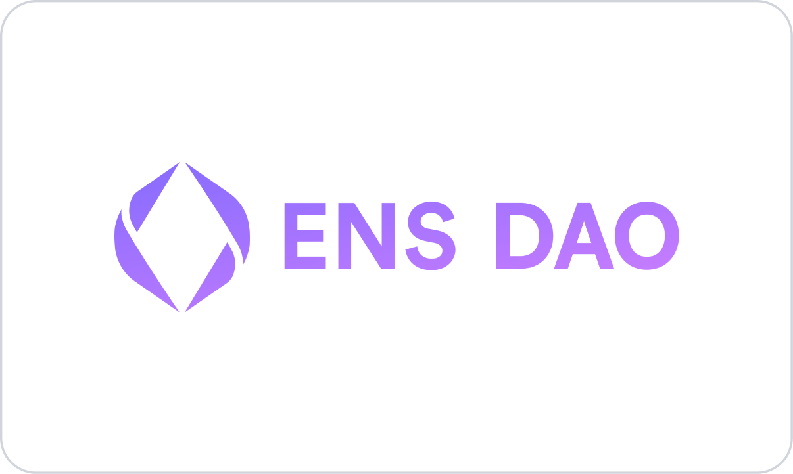
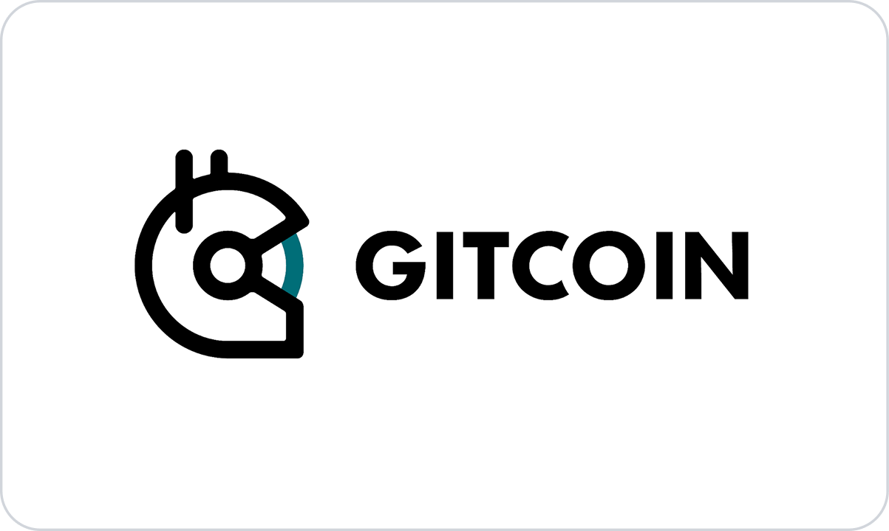

<!-- VERTICAL WHITESPACE -->

<br>

<!-- BANNER IMAGE -->

<p align="center">
  <a href="https://ensnode.io">
    <picture>
      <source media="(prefers-color-scheme: dark)" srcset=".github/assets/ensnode-banner-dark.svg">
      
    </picture>
  </a>
</p>

<!-- VERTICAL WHITESPACE -->

<br>

# ENSNode

[ENSNode](https://ensnode.io) is the multichain indexer for ENS, with first-class support for [ENSv2](https://roadmap.ens.domains/roadmap/). It exposes a unified GraphQL API — the **ENS Omnigraph** — over both ENSv1 and ENSv2.

- 📚 **Docs:** [ensnode.io](https://ensnode.io)
- 🚀 **Quickstart:** [ensnode.io/docs/integrate](https://ensnode.io/docs/integrate)
- 💬 **Telegram:** [t.me/ensnode](https://t.me/ensnode)

## Example: query a name via the Omnigraph

```graphql
query HelloWorld {
  domain(by: { name: "eth" }) {
    __typename
    canonical { name { interpreted } }
    owner { address }
    subdomains(first: 20) {
      totalCount
      edges { node { __typename canonical { name { interpreted } } owner { address } } }
    }
  }
}
```

See [`examples/omnigraph-graphql-example`](examples/omnigraph-graphql-example) for the full runnable script, and the [Quickstart](https://ensnode.io/docs/integrate) for `enskit` (React), `enssdk` (TypeScript), and direct GraphQL integrations.

## Running with Docker

```bash
docker compose -f docker/docker-compose.yml up -d
```

See [`docker/README.md`](docker/README.md) for all use cases and commands.

## Contributing

See [CONTRIBUTING.md](CONTRIBUTING.md).

## Sponsors

NameHash has received generous support from the [ENS DAO](https://ensdao.org/) and [Gitcoin](https://www.gitcoin.co/).

<p align="middle">
  <a href="https://ensdao.org/" target="_blank"></a>
  <a href="https://www.gitcoin.co/" target="_blank" style="text-decoration: none;"></a>
</p>

## License

Licensed under the MIT License, Copyright © 2025-present [NameHash Labs](https://namehashlabs.org).

See [LICENSE](./LICENSE) for more information.
