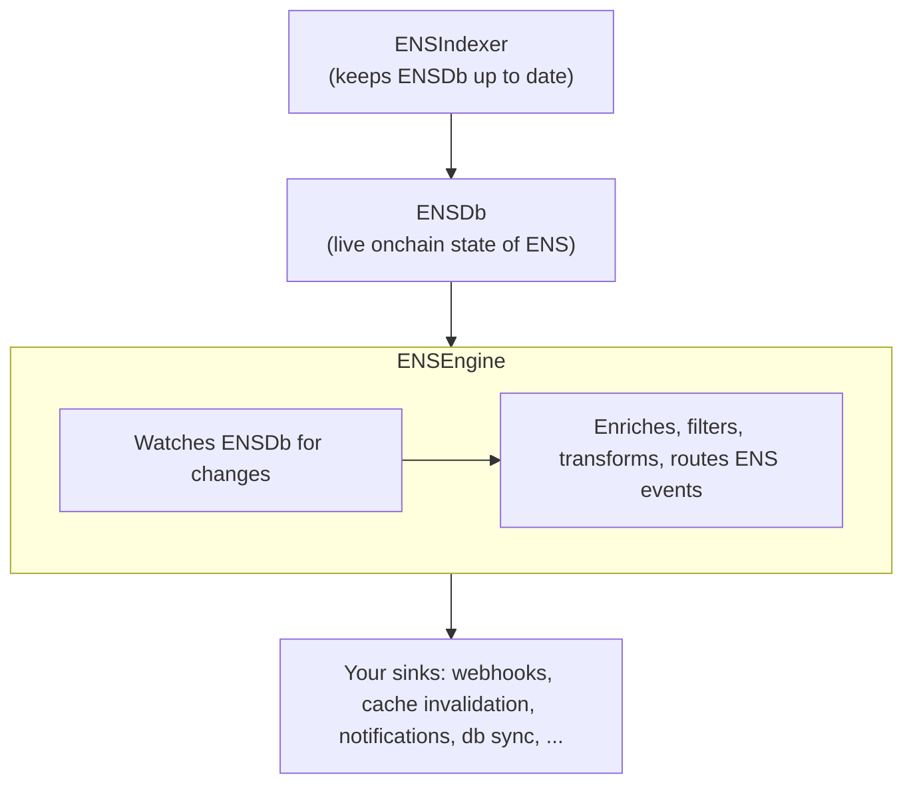

import { LinkCard, Aside } from "@astrojs/starlight/components";

<Aside type="caution" title="Coming soon - and the name is temporary">
**ENSEngine** is a planned ENSNode service that does not exist yet. The name is a working code name and may change before launch. This page introduces the value proposition ahead of time - APIs, payloads, delivery guarantees, and release dates are still in flux.
</Aside>

## Vision

Make ENS state changes **subscribable**.

Today, building an app that reacts to ENS - when an avatar changes, when a name is transferred, when a renewal happens - means either polling endlessly or running your own indexer. Both are heavy. ENSEngine exists to remove that work and turn ENS into a push-based protocol from the consumer's point of view: subscribe, get notified, build.

## What it is

ENSEngine is the part of ENSNode that **watches your ENSDb for changes in real time and delivers ENS-aware events** - including webhooks - to any sink you configure.

It's positioned as a separate service alongside [ENSIndexer](/docs/services/ensindexer), [ENSDb](/docs/services/ensdb), [ENSRainbow](/docs/services/ensrainbow), [ENSApi](/docs/services/ensapi), and [ENSAdmin](/docs/services/ensadmin). Once it ships, it'll be the home for reactive / event-based functionality across the ENSNode stack.

## How it works

In one sentence: **ENSIndexer keeps ENSDb fresh, ENSEngine watches ENSDb for changes and turns them into ENS-aware events for any sink you configure.**

The internal pipeline is intentionally simple to describe:

- **Watch** - observe ENSDb in real time as ENSIndexer updates it.
- **Enrich** - attach ENS-level context to raw changes so consumers don't have to.
- **Filter** - apply subscription rules so each sink only sees events it cares about.
- **Transform** - shape events into the right payload for each sink type.
- **Route** - deliver to webhooks, cache-invalidation hooks, database sync targets, notification systems, and more.

Implementation details behind the watch layer are intentionally not part of this teaser. Those will land in dedicated docs when the service ships.

## What it unlocks

The top priority for ENSEngine is **cache invalidation**. The goal is an ENS-native invalidation signal that lets apps and CDNs cache ENS data much more aggressively, then react when relevant onchain state changes. That's the foundation for web2-grade latency on a web3 protocol, especially for high-traffic ENS profile views.

Adjacent value props enabled by the same primitive (not promised as separate features):

- **Notification services** - name-expiry reminders, transfer alerts, registration bots in Discord/Telegram.
- **Database sync** - keep your own app's database in step with ENS state for marketplaces, portfolio trackers, analytics dashboards, search indices.
- **Realtime dashboards** - surface activity as it happens, with no polling overhead.

For a longer use-case-focused overview from the *integrate* perspective, see the [Webhooks & events teaser](/docs/integrate/webhooks-and-events).

## Position in the ENSNode stack

ENSEngine is one of several planned and existing services that build on top of [ENSDb](/docs/services/ensdb). ENSDb is the open standard that holds the live, multichain onchain state of ENS in a plain PostgreSQL database. From there, different services consume that state in different ways:

- **[ENSApi](/docs/services/ensapi)** - pull model: GraphQL / REST APIs for clients.
- **[ENSDb snapshots & CLI](/docs/integrate/ensdb-snapshots-and-cli) (planned)** - operational model: portable snapshots and CLI tooling.
- **ENSEngine (planned)** - push model: real-time, ENS-aware events delivered to your sinks.

## What this page is not

This is a teaser, not a spec. There is no subscription endpoint to call yet, no SDK to integrate against, no event payload schema to validate. Delivery guarantees (at-least-once, ordering, retries) are aspirations that haven't been committed to in writing yet. Release timing is not promised.

If your use case would benefit from ENS-native, real-time events, it's a great moment to share what you'd need - design choices are still flexible.

## Related

<LinkCard
  title="Webhooks & events (integrate)"
  description="The value-prop teaser written from the perspective of a developer adopting ENSEngine."
  href="/docs/integrate/webhooks-and-events"
/>

<LinkCard
  title="ENSDb overview"
  description="The foundation ENSEngine builds on - the live, onchain state of ENS in plain Postgres."
  href="/docs/services/ensdb"
/>

<LinkCard
  title="ENSDb snapshots & CLI (planned)"
  description="The other coming-soon capability built on ENSDb: bootstrap a fresh ENSDb in minutes."
  href="/docs/integrate/ensdb-snapshots-and-cli"
/>
