import { Aside } from '@astrojs/starlight/components';

ENSDb is a **bi-directional open standard** for ENS integration. This page explains the architecture: how data flows from onchain to your applications, and how ENSDb instances are served from PostgreSQL servers.

For terminology definitions, see the [Glossary](/ensdb/concepts/glossary).

## The ENSDb Open Standard

ENSDb defines a standard way to store and query ENS data in a PostgreSQL database. The standard is **implementation-agnostic** — anyone can build writers, readers, or both.

### Key Concepts

| Term | Definition |
|------|------------|
| **ENSDb** | An open standard defining schemas, rules, and constraints for ENS data in a PostgreSQL database |
| **ENSDb Instance** | A PostgreSQL database that follows the ENSDb standard |
| **PostgreSQL Server** | A running PostgreSQL process that can serve multiple ENSDb instances (databases) |

### Bi-Directional Integration Pattern

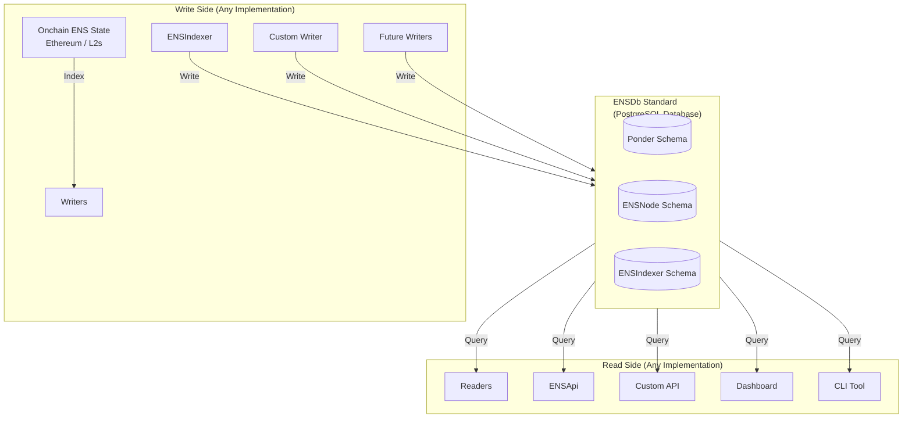

**Writers** index onchain ENS data and write to ENSDb. **Readers** query ENSDb and serve data to applications. Both can be built in any programming language with PostgreSQL support.

## PostgreSQL Server vs ENSDb Instance

Understanding the relationship between servers and instances is key to deploying ENSDb:

### [PostgreSQL Server](/ensdb/concepts/glossary#postgresql-server)

A **[PostgreSQL server](/ensdb/concepts/glossary#postgresql-server)** is a running PostgreSQL process that can host multiple databases:

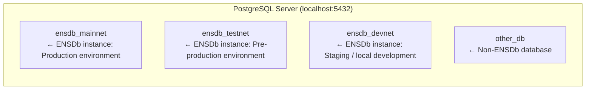

### [ENSDb Instance](/ensdb/concepts/glossary#ensdb-instance)

An **[ENSDb instance](/ensdb/concepts/glossary#ensdb-instance)** is a single PostgreSQL database that follows the [ENSDb](/ensdb/concepts/glossary#ensdb) standard:

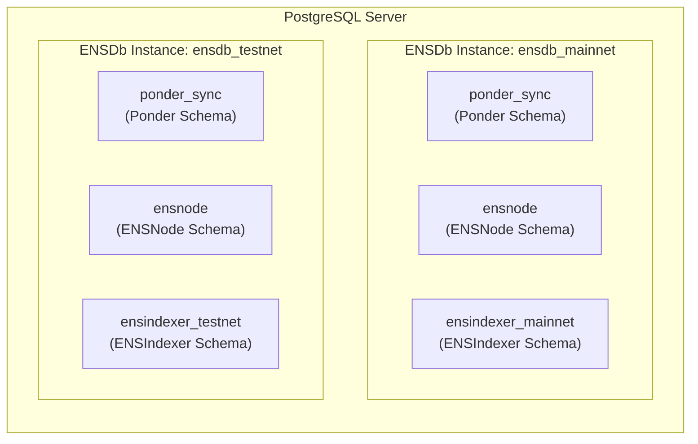

<Aside type="tip">
Each ENSDb instance is completely independent with its own schemas. They just happen to be served from the same PostgreSQL server.
</Aside>

## Instance Structure

An [ENSDb instance](/ensdb/concepts/glossary#ensdb-instance) — a single PostgreSQL database — contains exactly:

- **1 [Ponder Schema](/ensdb/concepts/glossary#ponder-schema)** — named `ponder_sync` (fixed)
- **1 [ENSNode Schema](/ensdb/concepts/glossary#ensnode-schema)** — named `ensnode` (fixed)
- **1+ [ENSIndexer Schemas](/ensdb/concepts/glossary#ensindexer-schema)** — dynamic names, one per writer

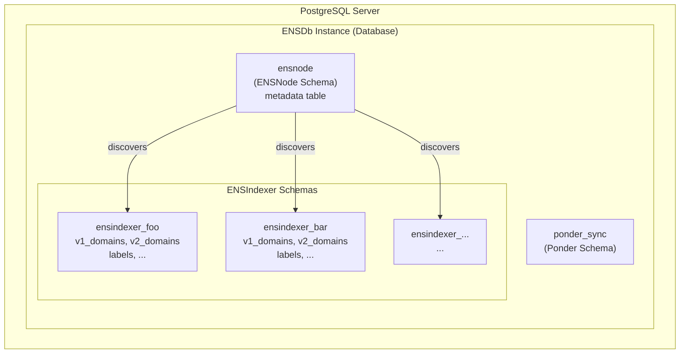

## Schema Relationships

### ENSNode Metadata → ENSIndexer Schemas

The [ENSNode Metadata Table](/ensdb/concepts/glossary#ensnode-metadata-table) links to ENSIndexer Schemas via the `ens_indexer_schema_name` column:

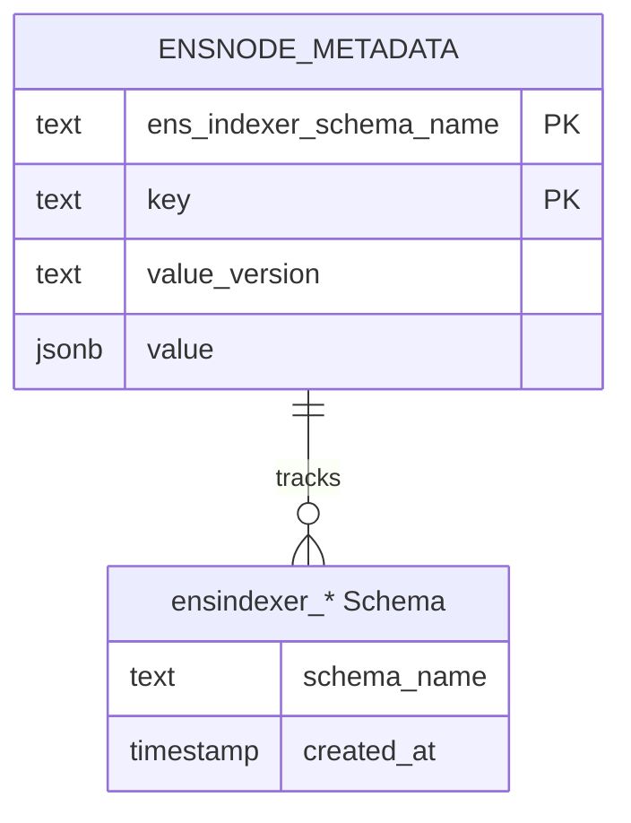

```sql
-- [Schema Discovery](/ensdb/concepts/glossary#schema-discovery): find all ENSIndexer Schemas
SELECT DISTINCT ens_indexer_schema_name
FROM ensnode.metadata;

-- Result example:
--  ensindexer_schema_name
-- ────────────────────────
--  ensindexer_mainnet
--  ensindexer_base
--  ensindexer_custom
```

Each writer has at least one row in [ENSNode Metadata Table](/ensdb/concepts/glossary#ensnode-metadata-table), with its `ens_indexer_schema_name` pointing to the [ENSIndexer Schema](/ensdb/concepts/glossary#ensindexer-schema) it owns.

### Ponder Schema → ENSIndexer Schemas

All writers share the [Ponder Schema](/ensdb/concepts/glossary#ponder-schema) for RPC caching:

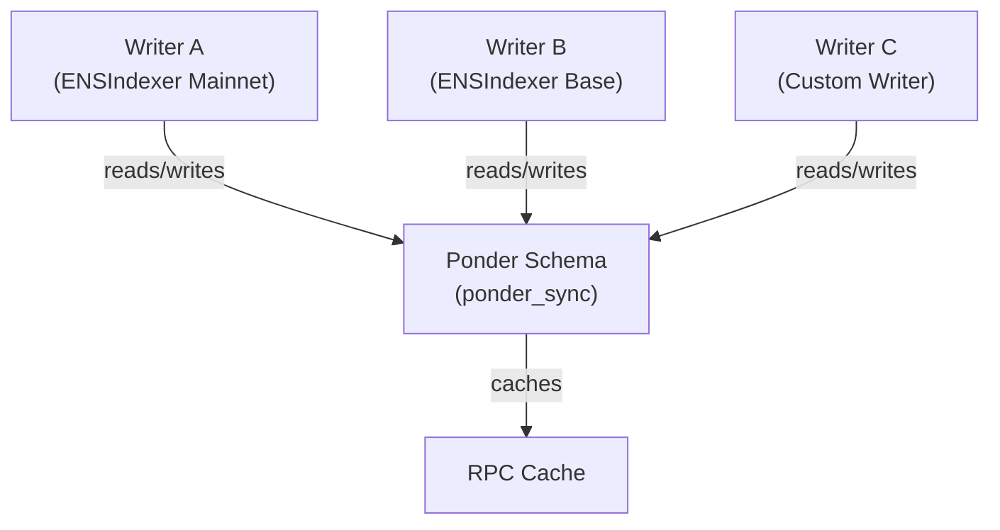

When any writer performs an RPC call, the result is cached in the [Ponder Schema](/ensdb/concepts/glossary#ponder-schema). Subsequent requests for the same data (from any writer) use the cached result, reducing RPC costs.

## Data Flow

### Indexing Flow (Writers)

1. **Writer** starts indexing from onchain
2. Reads onchain data via RPC (cached in **[Ponder Schema](/ensdb/concepts/glossary#ponder-schema)**)
3. Transforms data according to ENSDb schema
4. Writes transformed data to its **[ENSIndexer Schema](/ensdb/concepts/glossary#ensindexer-schema)**
5. Updates [Indexing Status](/ensdb/concepts/glossary#indexing-status) in **[ENSNode Metadata Table](/ensdb/concepts/glossary#ensnode-metadata-table)**

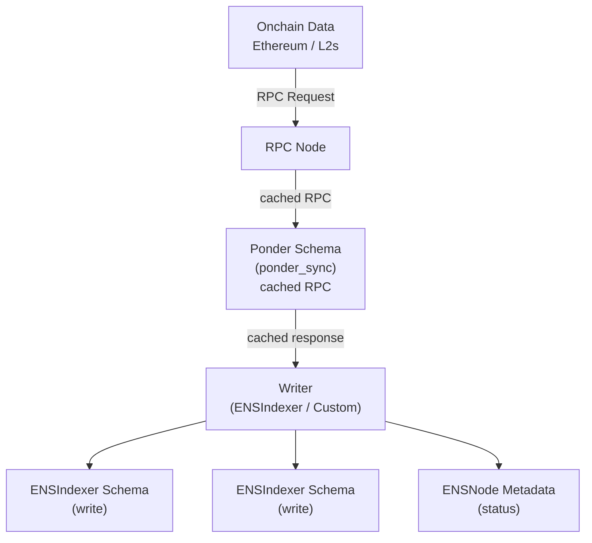

### Query Flow (Readers)

1. **Reader** connects to an ENSDb instance (PostgreSQL database)
2. Queries [ENSNode Metadata Table](/ensdb/concepts/glossary#ensnode-metadata-table) to discover [ENSIndexer Schemas](/ensdb/concepts/glossary#ensindexer-schema)
3. Queries specific [ENSIndexer Schema](/ensdb/concepts/glossary#ensindexer-schema) for data
4. Transforms and serves data to applications

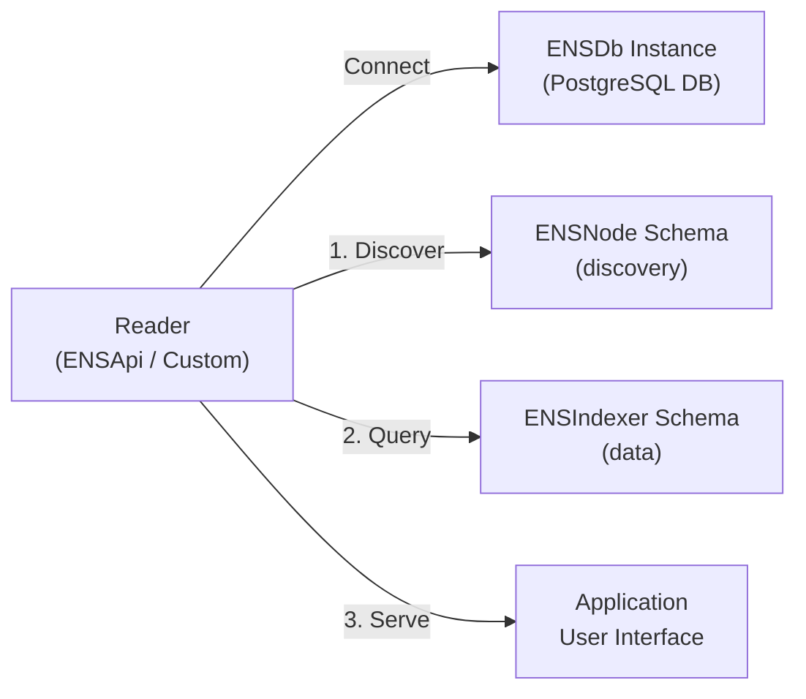

```sql
-- 1. Connect to specific ENSDb instance
-- psql postgresql://host:5432/ensdb_mainnet

-- 2. Discover available schemas in this instance
SELECT ens_indexer_schema_name, value
FROM ensnode.metadata
WHERE key = 'ensindexer_indexing_status';

-- 3. Query data from a specific ENSIndexer Schema
SELECT * FROM ensindexer_mainnet.v1_domains
WHERE owner_id = '\x1234...';
```

## [Multi-Tenant ENSDb](/ensdb/concepts/glossary#multi-tenant-ensdb): Multiple ENSIndexer Instances Per ENSDb Instance

An ENSDb instance is **multi-tenant** because a single database can store data from multiple [ENSIndexer instances](/ensdb/concepts/glossary#ensindexer-instance) (tenants), each operating independently:

| Writer | Owns Schema | Purpose |
|--------|-------------|---------|
| ENSIndexer Mainnet | `ensindexer_mainnet` | Ethereum mainnet ENS data |
| ENSIndexer Base | `ensindexer_base` | Base L2 ENS data |
| Custom Writer | `ensindexer_custom` | Custom indexing logic |

Each tenant (ENSIndexer instance):
- Has its own [ENSIndexer Schema](/ensdb/concepts/glossary#ensindexer-schema) — isolated data namespace
- Shares the [Ponder Schema](/ensdb/concepts/glossary#ponder-schema) — shared RPC cache across all tenants
- Has its own row in [ENSNode Metadata Table](/ensdb/concepts/glossary#ensnode-metadata-table) — tracked status per tenant

Multitenancy enables:
- **Separate indexing per chain** — mainnet, L2s, testnets as independent tenants
- **Independent operation** — one tenant can restart while others continue unaffected
- **Custom indexing** — specialized tenants for specific use cases
- **[Schema Version](/ensdb/concepts/glossary#schema-version) evolution** — different tenants can use different schema versions

## Multi-Instance: Multiple ENSDb Instances Per Server

A single PostgreSQL server can serve multiple ENSDb instances for different environments:

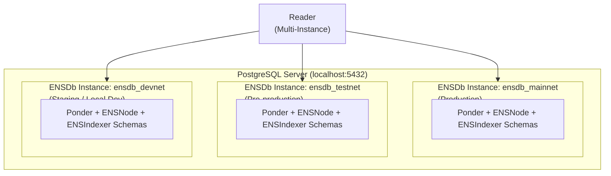

This enables:
- **Cost efficiency** — One PostgreSQL server, multiple ENS datasets
- **Organization** — Separate production, staging, and test data
- **Multi-chain aggregation** — Query across instances for cross-chain views

## Scalability Patterns

ENSDb can scale to handle massive workloads:

### Multiple Readers Per Instance

Any number of readers can query the same ENSDb instance:

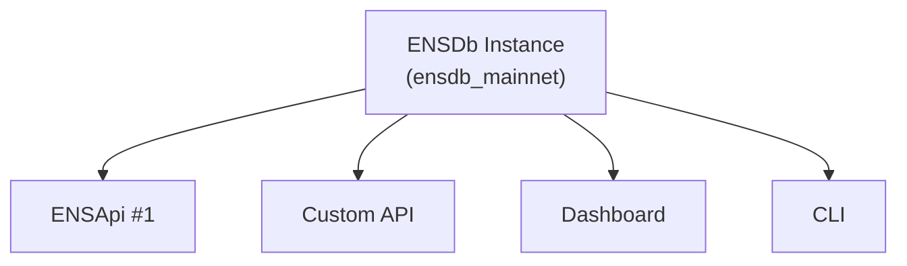

### Read Replicas

Distribute read load across PostgreSQL replicas:

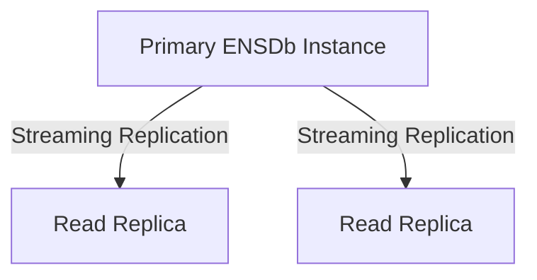

### Future: ENS Sync Engine

The upcoming ENS Sync Engine will enable:
- Real-time event streaming from PostgreSQL WAL
- Cache invalidation automation
- Continuous sync between ENSDb instances without running writers

## Related Concepts

- **[Glossary](/ensdb/concepts/glossary)** — Definitions for all terms used here
- **[Database Schemas](/ensdb/concepts/database-schemas)** — Deep dive on each schema type
- **[Indexing Lifecycle](/ensdb/concepts/indexing-lifecycle)** — How indexing phases affect database behavior
- **[Building Integrations](/ensdb/integrations/)** — Build custom writers and readers
