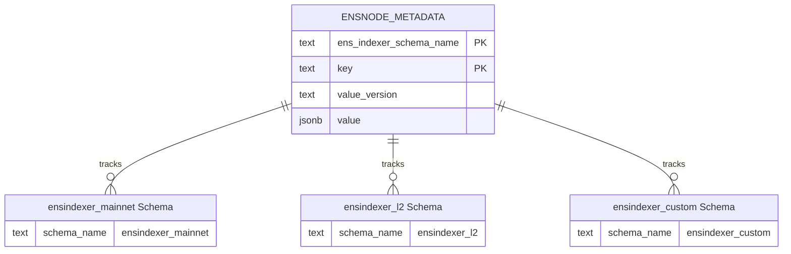
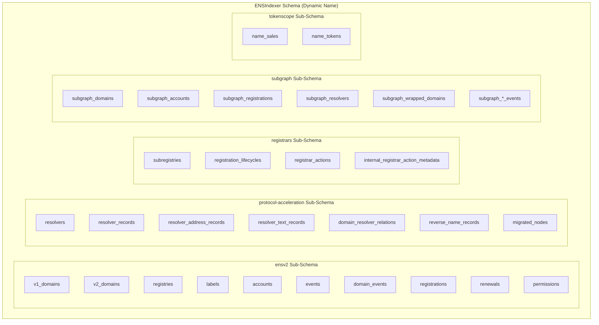
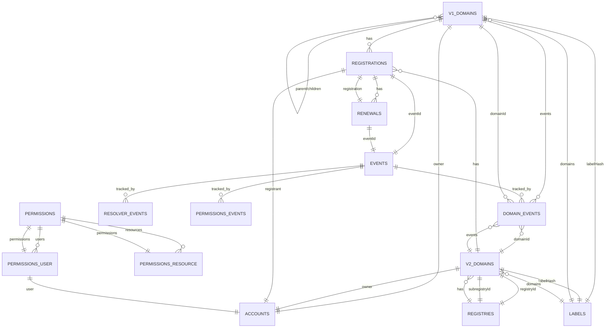
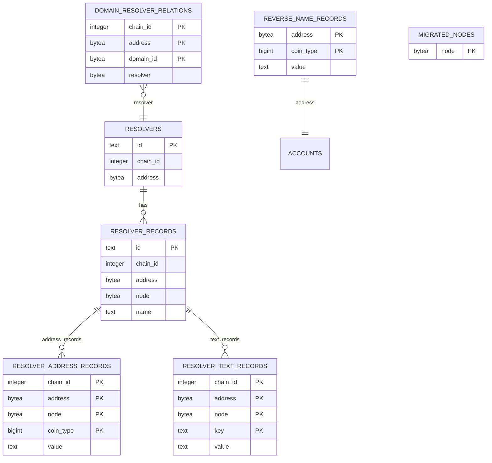
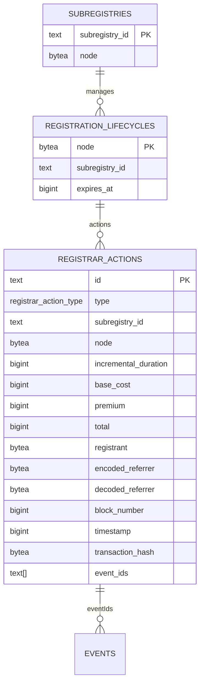
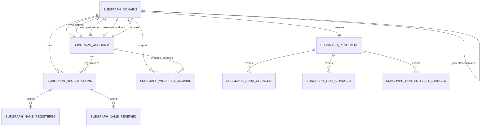
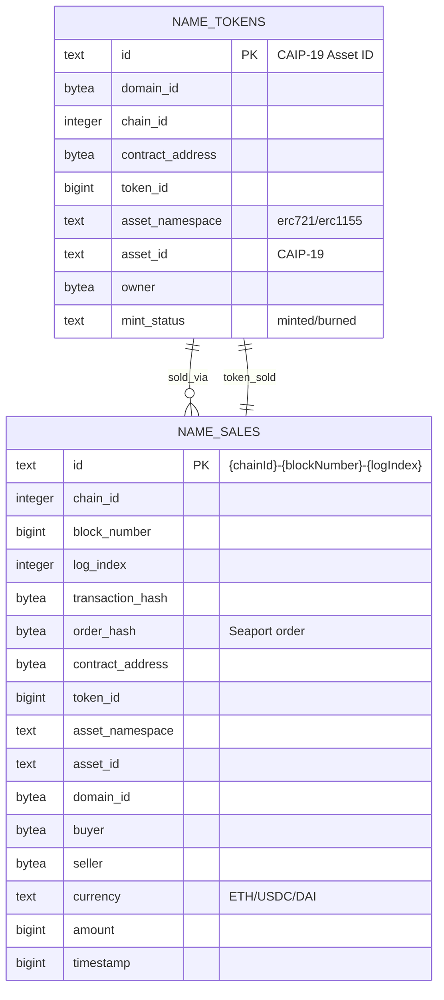
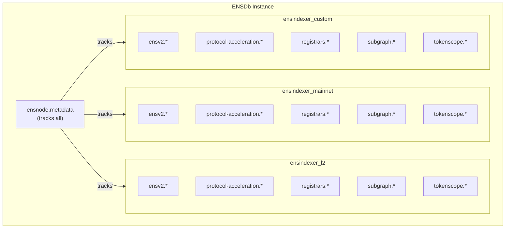

import { Aside } from '@astrojs/starlight/components';

ENSDb organizes data using PostgreSQL [database schemas](/ensdb/concepts/glossary#database-schema). Each schema serves a specific purpose and has specific ownership and naming rules.

For terminology definitions, see the [Glossary](/ensdb/concepts/glossary).

## Schema Types Overview

| Schema | Name | Fixed Name? | Owner | Purpose |
|--------|------|-------------|-------|---------|
| [Ponder Schema](#ponder-schema) | `ponder_sync` | Yes | Shared | RPC cache |
| [ENSNode Schema](#ensnode-schema) | `ensnode` | Yes | ENSNode instance | Metadata |
| [ENSIndexer Schema](#ensindexer-schema) | Dynamic | No | [ENSIndexer instance](/ensdb/concepts/glossary#ensindexer-instance) | Indexed data |

## Ponder Schema

The [Ponder Schema](/ensdb/concepts/glossary#ponder-schema) caches RPC requests and responses to optimize indexing performance.

### Properties

- **Name:** `ponder_sync` (fixed)
- **Created by:** Ponder (external tool)
- **Shared by:** All [ENSIndexer instances](/ensdb/concepts/glossary#ensindexer-instance) connected to the [ENSDb instance](/ensdb/concepts/glossary#ensdb-instance)
- **[Schema Definition](/ensdb/concepts/glossary#schema-definition):** Defined by Ponder

### Purpose

When an [ENSIndexer instance](/ensdb/concepts/glossary#ensindexer-instance) indexes onchain data, it makes RPC calls to blockchain nodes. The [Ponder Schema](/ensdb/concepts/glossary#ponder-schema) caches these calls — including block headers, contract storage slots, call results, and event logs — so that:

1. Multiple [ENSIndexer instances](/ensdb/concepts/glossary#ensindexer-instance) don't make duplicate RPC calls
2. Restarting an [ENSIndexer instance](/ensdb/concepts/glossary#ensindexer-instance) doesn't require re-fetching cached data
3. RPC costs are reduced

### Behavior

- **Do not drop manually** — If dropped, Ponder will recreate it, but with increased RPC costs during the backfill period
- Schema is managed by Ponder, not by ENSNode

### RPC Cache and ENS Namespaces

The Ponder Schema caches RPC data **only for the chains being indexed** by ENSIndexer instances connected to the ENSDb instance. This has important implications for ENS Namespaces:

| Setup | RPC Cache Contents |
|-------|-------------------|
| All ENSIndexer instances index "mainnet" namespace | Mainnet chains only |
| All ENSIndexer instances index "sepolia" namespace | Testnet chains only |
| Mixed namespaces (mainnet + sepolia instances) | Both mainnet and testnet chains |

**Critical consideration:** In a mixed-namespace setup, approximately 95%+ of cached RPC data will be for mainnet chains due to the significantly larger onchain history and state. This makes the Ponder Schema inefficient for testnet-only operations — the cache will be dominated by mainnet data while testnet data constitutes a tiny fraction.

**Recommendation:** For a lean ENSNode setup dedicated to testnets, use a **separate ENSDb instance** for the "sepolia" namespace. This ensures:
- The Ponder Schema contains **only testnet RPC cache**
- ENSDb snapshots are **significantly smaller** (no mainnet bloat)
- You can **precisely snapshot and restore** testnet state
- **Substantial RPC cost savings** (hundreds to thousands of dollars) when spinning up new testnet instances, as the cache is already primed with relevant testnet data

Conversely, mixing mainnet and sepolia in a single ENSDb instance pollutes the cache with mostly mainnet data, making it unsuitable for efficient testnet-only deployments.

## ENSNode Schema

The [ENSNode Schema](/ensdb/concepts/glossary#ensnode-schema) stores metadata about [ENSIndexer instances](/ensdb/concepts/glossary#ensindexer-instance) and their [Indexing Status](/ensdb/concepts/glossary#indexing-status).

### Properties

- **Name:** `ensnode` (fixed)
- **Created by:** First ENSIndexer instance to connect
- **Schema Definition:** `@ensnode/ensdb-sdk/ensnode`

### Multi-Tenancy: Tracking Multiple ENSIndexer Schemas

A single ENSNode Schema tracks metadata for **multiple** ENSIndexer Schemas within the same ENSDb instance. This enables multi-tenant indexing where different chains, configurations, or use cases can be indexed independently.



### Contents

The ENSNode Schema contains a single table: [ENSNode Metadata Table](#ensnode-metadata-table).

### ENSNode Metadata Table

| Column | Type | Description |
|--------|------|-------------|
| `ens_indexer_schema_name` | `text` | Name of the [ENSIndexer Schema](/ensdb/concepts/glossary#ensindexer-schema) this record belongs to |
| `key` | `text` | Type of metadata record |
| `value_version` | `text` | [ENSNode Metadata Value Version](/ensdb/concepts/glossary#ensnode-metadata-value-version) |
| `value` | `jsonb` | The metadata content |

**Primary Key:** (`ens_indexer_schema_name`, `key`)

### Common Metadata Keys

| Key | Purpose |
|-----|---------|
| `ensindexer_indexing_status` | Current [Indexing Status](/ensdb/concepts/glossary#indexing-status) and progress |
| `ensindexer_public_config` | Public configuration of the [ENSIndexer instance](/ensdb/concepts/glossary#ensindexer-instance) |
| `ensdb_version` | [ENSDb version](/ensdb/concepts/glossary#ensdb-sdk) information for this instance |

### Behavior

- **Do not drop manually** — If dropped, ENSNode cannot track [ENSIndexer instances](/ensdb/concepts/glossary#ensindexer-instance)
- The first [ENSIndexer instance](/ensdb/concepts/glossary#ensindexer-instance) to connect creates the schema and migrations table
- Each [ENSIndexer instance](/ensdb/concepts/glossary#ensindexer-instance) writes its own row(s) with its [ENSIndexer Schema Name](/ensdb/concepts/glossary#ensindexer-schema-name)

### Schema Discovery

Query [ENSNode Metadata Table](/ensdb/concepts/glossary#ensnode-metadata-table) to discover all [ENSIndexer Schemas](/ensdb/concepts/glossary#ensindexer-schema):

```sql
SELECT DISTINCT ens_indexer_schema_name
FROM ensnode.metadata;
```

## ENSIndexer Schema

Each [ENSIndexer instance](/ensdb/concepts/glossary#ensindexer-instance) owns an [ENSIndexer Schema](/ensdb/concepts/glossary#ensindexer-schema) where it writes indexed ENS data.

### Properties

- **Name:** Dynamic, determined by ENSIndexer instance configuration
- **Created by:** Ponder app running inside the ENSIndexer instance
- **Schema Definition:** `@ensnode/ensdb-sdk/ensindexer-abstract`

### Modular Sub-Schema Architecture

The ENSIndexer Schema is **modular** — it's composed of five distinct sub-schemas that each serve a specific purpose:

| Sub-Schema | SDK Path | Purpose | Key Entities |
|------------|----------|---------|--------------|
| **ensv2** | `/ensindexer-abstract/ensv2.schema` | Core ENS domain and event indexing | Domains, Events, Registrations, Labels |
| **protocol-acceleration** | `/ensindexer-abstract/protocol-acceleration.schema` | Resolution acceleration and resolver records | Resolvers, Reverse Names, Domain-Resolver Relations |
| **registrars** | `/ensindexer-abstract/registrars.schema` | Registration lifecycle tracking | Subregistries, Registration Lifecycles, Registrar Actions |
| **subgraph** | `/ensindexer-abstract/subgraph.schema` | Backward compatibility with legacy ENS Subgraph | Subgraph-compatible entities and events |
| **tokenscope** | `/ensindexer-abstract/tokenscope.schema` | NFT market data and token tracking | Name Sales, Name Tokens |

These sub-schemas work together to provide a complete picture of ENS onchain state while maintaining separation of concerns. All five sub-schemas exist within a single ENSIndexer Schema namespace.



### Naming

[ENSIndexer Schema](/ensdb/concepts/glossary#ensindexer-schema) names are dynamic. The name is determined by the [ENSIndexer instance](/ensdb/concepts/glossary#ensindexer-instance) based on its configuration.

Examples: `ensindexer_0`, `ensindexer_mainnet`, `ensindexer_abc123`

### Index Behavior

Indexes on [ENSIndexer Schema](/ensdb/concepts/glossary#ensindexer-schema) tables are created/dropped based on [Indexing Status](/ensdb/concepts/glossary#indexing-status):

| Status | [Indexes](/ensdb/concepts/glossary#database-objects) | Reason |
|--------|---------|--------|
| Backfill | Dropped | Optimize write throughput for historical data |
| Following | Created | Optimize read queries for live data |

See [Indexing Lifecycle](/ensdb/concepts/indexing-lifecycle) for details.

---

## Sub-Schema Reference

### ensv2 Sub-Schema

The **ensv2** sub-schema provides the core ENS protocol indexing functionality. It tracks domains (both ENSv1 and ENSv2), events, registrations, renewals, and labels.



#### Table: `events`

Core event log table storing all onchain event metadata.

| Column | Type | Constraints | Description |
|--------|------|-------------|-------------|
| `id` | `text` | Primary Key | Ponder's event.id |
| `chain_id` | `integer` | Not Null, Indexed | Chain ID (EIP-155) |
| `block_number` | `bigint` | Not Null | Block number |
| `block_hash` | `bytea` | Not Null | Block hash |
| `timestamp` | `bigint` | Not Null, Indexed | Block timestamp (Unix seconds) |
| `transaction_hash` | `bytea` | Not Null | Transaction hash |
| `transaction_index` | `integer` | Not Null | Transaction index in block |
| `from` | `bytea` | Not Null, Indexed | Transaction sender |
| `to` | `bytea` | Nullable | Transaction recipient (null for contract deployment) |
| `address` | `bytea` | Not Null | Contract address that emitted the event |
| `log_index` | `integer` | Not Null | Log index in transaction |
| `selector` | `bytea` | Not Null, Indexed | Event selector (topic0) |
| `topics` | `bytea[]` | Not Null | All event topics |
| `data` | `bytea` | Not Null | Event data payload |

**Indexes:**
- Primary Key: `id`
- `bySelector`: `selector`
- `byFrom`: `from`
- `byTimestamp`: `timestamp`

#### Table: `domain_events`

Join table linking domains to their events.

| Column | Type | Constraints | Description |
|--------|------|-------------|-------------|
| `domain_id` | `text` | Not Null, PK | Domain ID (namehash) |
| `event_id` | `text` | Not Null, PK | Event ID |

**Primary Key:** (`domain_id`, `event_id`)

#### Table: `resolver_events`

Join table linking resolvers to their events.

| Column | Type | Constraints | Description |
|--------|------|-------------|-------------|
| `resolver_id` | `text` | Not Null, PK | Resolver ID |
| `event_id` | `text` | Not Null, PK | Event ID |

**Primary Key:** (`resolver_id`, `event_id`)

#### Table: `permissions_events`

Join table linking permissions to their events.

| Column | Type | Constraints | Description |
|--------|------|-------------|-------------|
| `permissions_id` | `text` | Not Null, PK | Permissions ID |
| `event_id` | `text` | Not Null, PK | Event ID |

**Primary Key:** (`permissions_id`, `event_id`)

#### Table: `accounts`

Ethereum accounts that interact with ENS.

| Column | Type | Constraints | Description |
|--------|------|-------------|-------------|
| `id` | `bytea` | Primary Key | Ethereum address |

#### Table: `registries`

ENSv2 registries (both root and subregistries).

| Column | Type | Constraints | Description |
|--------|------|-------------|-------------|
| `id` | `text` | Primary Key | Registry ID (CAIP-10 format: chainId:address) |
| `chain_id` | `integer` | Not Null | Chain ID |
| `address` | `bytea` | Not Null | Registry contract address |

**Indexes:**
- Primary Key: `id`
- `byId`: Unique index on (`chain_id`, `address`)

#### Table: `v1_domains`

ENSv1 domain records (flat namespace, keyed by node).

| Column | Type | Constraints | Description |
|--------|------|-------------|-------------|
| `id` | `text` | Primary Key | Domain ID (node/namehash) |
| `parent_id` | `text` | Not Null, Indexed | Parent domain ID |
| `owner_id` | `bytea` | Nullable, Indexed | Effective owner address |
| `label_hash` | `bytea` | Not Null, Indexed | Label hash |
| `root_registry_owner_id` | `bytea` | Nullable | ENSv1 Registry owner (zeroAddress = null) |

**Indexes:**
- Primary Key: `id`
- `byParent`: `parent_id`
- `byOwner`: `owner_id`
- `byLabelHash`: `label_hash`

#### Table: `v2_domains`

ENSv2 domain records (registry-based namespace).

| Column | Type | Constraints | Description |
|--------|------|-------------|-------------|
| `id` | `text` | Primary Key | Domain ID |
| `token_id` | `bigint` | Not Null | ERC721 token ID |
| `registry_id` | `text` | Not Null, Indexed | Parent registry ID |
| `subregistry_id` | `text` | Nullable, Indexed | Subregistry ID (if domain is a registry) |
| `owner_id` | `bytea` | Nullable, Indexed | Domain owner address |
| `label_hash` | `bytea` | Not Null, Indexed | Label hash |

**Indexes:**
- Primary Key: `id`
- `byRegistry`: `registry_id`
- `bySubregistry`: `subregistry_id` (where not null)
- `byOwner`: `owner_id`
- `byLabelHash`: `label_hash`

#### Enum: `registration_type`

Registration types supported by the schema.

| Value | Description |
|-------|-------------|
| `NameWrapper` | NameWrapper registration |
| `BaseRegistrar` | BaseRegistrar registration |
| `ThreeDNS` | 3DNS registration |
| `ENSv2RegistryRegistration` | ENSv2 Registry registration |
| `ENSv2RegistryReservation` | ENSv2 Registry reservation |

#### Table: `registrations`

Domain registration records (polymorphic across types).

| Column | Type | Constraints | Description |
|--------|------|-------------|-------------|
| `id` | `text` | Primary Key | Registration ID (domainId:registrationIndex) |
| `domain_id` | `text` | Not Null, Indexed | Domain ID |
| `registration_index` | `integer` | Not Null | Index of this registration for the domain |
| `type` | `registration_type` | Not Null | Registration type |
| `start` | `bigint` | Not Null | Registration start timestamp |
| `expiry` | `bigint` | Nullable | Registration expiry timestamp |
| `grace_period` | `bigint` | Nullable | Grace period duration (for BaseRegistrar) |
| `registrar_chain_id` | `integer` | Not Null | Registrar chain ID |
| `registrar_address` | `bytea` | Not Null | Registrar contract address |
| `registrant_id` | `bytea` | Nullable | Registrant address |
| `unregistrant_id` | `bytea` | Nullable | Previous registrant (on transfer) |
| `referrer` | `bytea` | Nullable | Encoded referrer data |
| `fuses` | `integer` | Nullable | NameWrapper fuses |
| `base` | `bigint` | Nullable | Base cost in wei |
| `premium` | `bigint` | Nullable | Premium cost in wei |
| `wrapped` | `boolean` | Default: false | Whether registration is wrapped |
| `event_id` | `text` | Not Null | Event that created this registration |

**Indexes:**
- Primary Key: `id`
- `byId`: Unique index on (`domain_id`, `registration_index`)

#### Table: `latest_registration_indexes`

Tracks the latest registration index for each domain.

| Column | Type | Constraints | Description |
|--------|------|-------------|-------------|
| `domain_id` | `text` | Primary Key | Domain ID |
| `registration_index` | `integer` | Not Null | Latest registration index |

#### Table: `renewals`

Domain renewal records.

| Column | Type | Constraints | Description |
|--------|------|-------------|-------------|
| `id` | `text` | Primary Key | Renewal ID (domainId:registrationIndex:renewalIndex) |
| `domain_id` | `text` | Not Null | Domain ID |
| `registration_index` | `integer` | Not Null | Registration index |
| `renewal_index` | `integer` | Not Null | Index of this renewal for the registration |
| `duration` | `bigint` | Not Null | Renewal duration in seconds |
| `referrer` | `bytea` | Nullable | Encoded referrer data |
| `base` | `bigint` | Nullable | Base cost in wei |
| `premium` | `bigint` | Nullable | Premium cost in wei |
| `event_id` | `text` | Not Null | Event that created this renewal |

**Indexes:**
- Primary Key: `id`
- `byId`: Unique index on (`domain_id`, `registration_index`, `renewal_index`)

#### Table: `latest_renewal_indexes`

Tracks the latest renewal index for each registration.

| Column | Type | Constraints | Description |
|--------|------|-------------|-------------|
| `domain_id` | `text` | Not Null, PK | Domain ID |
| `registration_index` | `integer` | Not Null, PK | Registration index |
| `renewal_index` | `integer` | Not Null | Latest renewal index |

**Primary Key:** (`domain_id`, `registration_index`)

#### Table: `permissions`

Permission manager contracts (ERC-7715 style).

| Column | Type | Constraints | Description |
|--------|------|-------------|-------------|
| `id` | `text` | Primary Key | Permissions ID (chainId:address) |
| `chain_id` | `integer` | Not Null | Chain ID |
| `address` | `bytea` | Not Null | Contract address |

**Indexes:**
- Primary Key: `id`
- `byId`: Unique index on (`chain_id`, `address`)

#### Table: `permissions_resources`

Permission resources within a permission manager.

| Column | Type | Constraints | Description |
|--------|------|-------------|-------------|
| `id` | `text` | Primary Key | Resource ID (chainId:address:resource) |
| `chain_id` | `integer` | Not Null | Chain ID |
| `address` | `bytea` | Not Null | Permission manager address |
| `resource` | `bigint` | Not Null | Resource identifier |

**Indexes:**
- Primary Key: `id`
- `byId`: Unique index on (`chain_id`, `address`, `resource`)

#### Table: `permissions_users`

Permission user assignments.

| Column | Type | Constraints | Description |
|--------|------|-------------|-------------|
| `id` | `text` | Primary Key | User assignment ID (chainId:address:resource:user) |
| `chain_id` | `integer` | Not Null | Chain ID |
| `address` | `bytea` | Not Null | Permission manager address |
| `resource` | `bigint` | Not Null | Resource identifier |
| `user` | `bytea` | Not Null | User address |
| `roles` | `bigint` | Not Null | Roles bitmap |

**Indexes:**
- Primary Key: `id`
- `byId`: Unique index on (`chain_id`, `address`, `resource`, `user`)

#### Table: `labels`

Label hash to interpreted label mapping (rainbow table for name healing).

| Column | Type | Constraints | Description |
|--------|------|-------------|-------------|
| `label_hash` | `bytea` | Primary Key | Label hash |
| `interpreted` | `text` | Not Null, Indexed | Interpreted label text |

**Indexes:**
- Primary Key: `label_hash`
- `byInterpreted`: `interpreted`

#### Table: `registry_canonical_domains`

Tracks canonical domain references for registries (temporary table).

| Column | Type | Constraints | Description |
|--------|------|-------------|-------------|
| `registry_id` | `text` | Primary Key | Registry ID |
| `domain_id` | `text` | Not Null | Canonical domain ID |

---

### protocol-acceleration Sub-Schema

The **protocol-acceleration** sub-schema provides data structures that accelerate ENS resolution and track resolver relationships.



#### Table: `reverse_name_records`

ENSIP-19 reverse name records indexed by account and coin type.

<Aside type="note">
This tracks reverse name records set via StandaloneReverseRegistrar (default.reverse, [coinType].reverse), NOT *.addr.reverse records. Forward resolution is still required for authoritative primary names.
</Aside>

| Column | Type | Constraints | Description |
|--------|------|-------------|-------------|
| `address` | `bytea` | Not Null, PK | Account address |
| `coin_type` | `bigint` | Not Null, PK | SLIP-44 coin type |
| `value` | `text` | Not Null | Reverse name record value |

**Primary Key:** (`address`, `coin_type`)

#### Table: `domain_resolver_relations`

Domain-to-resolver mappings for accelerated lookups.

| Column | Type | Constraints | Description |
|--------|------|-------------|-------------|
| `chain_id` | `integer` | Not Null, PK | Chain ID |
| `address` | `bytea` | Not Null, PK | Registry address |
| `domain_id` | `bytea` | Not Null, PK | Domain ID (node) |
| `resolver` | `bytea` | Not Null | Resolver contract address |

**Primary Key:** (`chain_id`, `address`, `domain_id`)

#### Table: `resolvers`

Resolver contracts that have emitted events.

| Column | Type | Constraints | Description |
|--------|------|-------------|-------------|
| `id` | `text` | Primary Key | Resolver ID (chainId:address) |
| `chain_id` | `integer` | Not Null | Chain ID |
| `address` | `bytea` | Not Null | Resolver contract address |

**Indexes:**
- Primary Key: `id`
- `byId`: Unique index on (`chain_id`, `address`)

#### Table: `resolver_records`

Resolver records for specific nodes.

| Column | Type | Constraints | Description |
|--------|------|-------------|-------------|
| `id` | `text` | Primary Key | Record ID (chainId:resolver:node) |
| `chain_id` | `integer` | Not Null | Chain ID |
| `address` | `bytea` | Not Null | Resolver address |
| `node` | `bytea` | Not Null | Node (namehash) |
| `name` | `text` | Nullable | ENSIP-3 name record value |

**Indexes:**
- Primary Key: `id`
- `byId`: Unique index on (`chain_id`, `address`, `node`)

<Aside type="caution">
Direct query of resolver records is NOT ENSIP-10 or CCIP-Read compliant. Always follow forward resolution according to the ENS protocol.
</Aside>

#### Table: `resolver_address_records`

Address records (ENSIP-9) within resolver records.

| Column | Type | Constraints | Description |
|--------|------|-------------|-------------|
| `chain_id` | `integer` | Not Null, PK | Chain ID |
| `address` | `bytea` | Not Null, PK | Resolver address |
| `node` | `bytea` | Not Null, PK | Node (namehash) |
| `coin_type` | `bigint` | Not Null, PK | SLIP-44 coin type |
| `value` | `text` | Not Null | Address record value (interpreted) |

**Primary Key:** (`chain_id`, `address`, `node`, `coin_type`)

#### Table: `resolver_text_records`

Text records (ENSIP-5) within resolver records.

| Column | Type | Constraints | Description |
|--------|------|-------------|-------------|
| `chain_id` | `integer` | Not Null, PK | Chain ID |
| `address` | `bytea` | Not Null, PK | Resolver address |
| `node` | `bytea` | Not Null, PK | Node (namehash) |
| `key` | `text` | Not Null, PK | Text record key |
| `value` | `text` | Not Null | Text record value |

**Primary Key:** (`chain_id`, `address`, `node`, `key`)

#### Table: `migrated_nodes`

Tracks nodes that have migrated from RegistryOld to the new Registry.

| Column | Type | Constraints | Description |
|--------|------|-------------|-------------|
| `node` | `bytea` | Primary Key | Migrated node (namehash) |

<Aside type="note">
Events on RegistryOld for migrated nodes should be ignored. This is only relevant for the ENS Root Chain.
</Aside>

---

### registrars Sub-Schema

The **registrars** sub-schema tracks registration lifecycles and registrar actions across different registrar implementations.



#### Table: `subregistries`

Subregistry contracts that manage subname registrations.

| Column | Type | Constraints | Description |
|--------|------|-------------|-------------|
| `subregistry_id` | `text` | Primary Key | Subregistry ID (CAIP-10: chainId:address) |
| `node` | `bytea` | Not Null, Unique | Node this subregistry manages subnames of |

**Indexes:**
- Primary Key: `subregistry_id`
- `uniqueNode`: Unique index on `node`

#### Table: `registration_lifecycles`

Tracks the current registration lifecycle for each name.

<Aside type="note">
Only the most recent registration lifecycle is tracked. If a name expires and is re-registered, only the new lifecycle is stored.
</Aside>

| Column | Type | Constraints | Description |
|--------|------|-------------|-------------|
| `node` | `bytea` | Primary Key | Domain node (namehash) |
| `subregistry_id` | `text` | Not Null | Subregistry managing this registration |
| `expires_at` | `bigint` | Not Null | Expiration timestamp |

**Indexes:**
- Primary Key: `node`
- `bySubregistry`: `subregistry_id`

#### Enum: `registrar_action_type`

Types of registrar actions.

| Value | Description |
|-------|-------------|
| `registration` | New registration |
| `renewal` | Renewal/extension |

#### Table: `registrar_actions`

Logical registrar actions aggregated from multiple events.

<Aside type="note">
A single "logical action" may aggregate data from multiple onchain events across different contracts (e.g., BaseRegistrar + RegistrarController events for one registration).
</Aside>

| Column | Type | Constraints | Description |
|--------|------|-------------|-------------|
| `id` | `text` | Primary Key | Action ID (Ponder checkpoint string) |
| `type` | `registrar_action_type` | Not Null | Action type |
| `subregistry_id` | `text` | Not Null | Subregistry ID |
| `node` | `bytea` | Not Null | Domain node |
| `incremental_duration` | `bigint` | Not Null | Duration added to registration |
| `base_cost` | `bigint` | Nullable | Base cost in wei |
| `premium` | `bigint` | Nullable | Premium cost in wei |
| `total` | `bigint` | Nullable | Total cost in wei (base + premium) |
| `registrant` | `bytea` | Not Null | Action initiator address |
| `encoded_referrer` | `bytea` | Nullable | Raw 32-byte referrer value |
| `decoded_referrer` | `bytea` | Nullable | Decoded referrer address |
| `block_number` | `bigint` | Not Null | Block number |
| `timestamp` | `bigint` | Not Null | Block timestamp |
| `transaction_hash` | `bytea` | Not Null | Transaction hash |
| `event_ids` | `text[]` | Not Null | Contributing event IDs |

**Indexes:**
- Primary Key: `id`
- `byDecodedReferrer`: `decoded_referrer`
- `byTimestamp`: `timestamp`

#### Table: `_ensindexer_registrar_action_metadata`

Internal metadata for aggregating registrar action data across events.

<Aside type="caution">
This is an internal implementation detail. Do not query directly.
</Aside>

| Column | Type | Constraints | Description |
|--------|------|-------------|-------------|
| `metadata_type` | `_ensindexer_registrar_action_metadata_type` | Primary Key | Metadata type |
| `logical_event_key` | `text` | Not Null | Key for grouping events (domainId:transactionHash) |
| `logical_event_id` | `text` | Not Null | Current logical action ID being built |

---

### subgraph Sub-Schema

The **subgraph** sub-schema provides backward compatibility with the legacy ENS Subgraph data model. When paired with `@ensnode/ponder-subgraph`, it enables a fully subgraph-compatible GraphQL API.



#### Table: `subgraph_domains`

Subgraph-compatible domain entity.

| Column | Type | Constraints | Description |
|--------|------|-------------|-------------|
| `id` | `bytea` | Primary Key | Namehash |
| `name` | `text` | Nullable | Domain name (subgraph-interpreted or normalized) |
| `label_name` | `text` | Nullable | Label name |
| `labelhash` | `bytea` | Nullable, Indexed | Label hash |
| `parent_id` | `bytea` | Nullable, Indexed | Parent domain namehash |
| `subdomain_count` | `integer` | Not Null, Default: 0 | Number of subdomains |
| `resolved_address_id` | `bytea` | Nullable, Indexed | Resolved address |
| `resolver_id` | `text` | Nullable | Resolver ID |
| `ttl` | `bigint` | Nullable | Time-to-live |
| `is_migrated` | `boolean` | Not Null, Default: false | Migration status |
| `created_at` | `bigint` | Not Null | Creation timestamp |
| `owner_id` | `bytea` | Not Null, Indexed | Owner address |
| `registrant_id` | `bytea` | Nullable, Indexed | Registrant address |
| `wrapped_owner_id` | `bytea` | Nullable, Indexed | Wrapped owner address |
| `expiry_date` | `bigint` | Nullable | Expiration date |

**Indexes:**
- Primary Key: `id`
- `byLabelhash`: `labelhash`
- `byParentId`: `parent_id`
- `byOwnerId`: `owner_id`
- `byRegistrantId`: `registrant_id`
- `byWrappedOwnerId`: `wrapped_owner_id`
- `byResolvedAddressId`: `resolved_address_id`

<Aside type="note">
String columns `name` and `labelName` use PostgreSQL collation "C" for subgraph compatibility.
</Aside>

#### Table: `subgraph_accounts`

Subgraph-compatible account entity.

| Column | Type | Constraints | Description |
|--------|------|-------------|-------------|
| `id` | `bytea` | Primary Key | Ethereum address |

#### Table: `subgraph_resolvers`

Subgraph-compatible resolver entity.

| Column | Type | Constraints | Description |
|--------|------|-------------|-------------|
| `id` | `text` | Primary Key | Resolver ID (domainId:address) |
| `domain_id` | `bytea` | Not Null, Indexed | Domain ID |
| `address` | `bytea` | Not Null | Resolver address |
| `addr_id` | `bytea` | Nullable | Current addr record |
| `content_hash` | `text` | Nullable | Contenthash |
| `texts` | `text[]` | Nullable | Observed text record keys |
| `coin_types` | `bigint[]` | Nullable | Observed coin types |

**Indexes:**
- Primary Key: `id`
- `byDomainId`: `domain_id`

#### Table: `subgraph_registrations`

Subgraph-compatible registration entity.

| Column | Type | Constraints | Description |
|--------|------|-------------|-------------|
| `id` | `bytea` | Primary Key | Registration ID |
| `domain_id` | `bytea` | Not Null, Indexed | Domain ID |
| `registration_date` | `bigint` | Not Null | Registration timestamp |
| `expiry_date` | `bigint` | Not Null | Expiry timestamp |
| `cost` | `bigint` | Nullable | Registration cost |
| `registrant_id` | `bytea` | Not Null, Indexed | Registrant address |
| `label_name` | `text` | Nullable | Label name |

**Indexes:**
- Primary Key: `id`
- `byDomainId`: `domain_id`
- `byRegistrationDate`: `registration_date`
- `byExpiryDate`: `expiry_date`

#### Table: `subgraph_wrapped_domains`

Subgraph-compatible wrapped domain entity.

| Column | Type | Constraints | Description |
|--------|------|-------------|-------------|
| `id` | `bytea` | Primary Key | Wrapped domain ID |
| `domain_id` | `bytea` | Not Null, Indexed | Domain ID |
| `expiry_date` | `bigint` | Not Null | Expiry timestamp |
| `fuses` | `integer` | Not Null | Fuses bitmap |
| `owner_id` | `bytea` | Not Null | Owner address |
| `name` | `text` | Nullable | DNS-encoded name |

**Indexes:**
- Primary Key: `id`
- `byDomainId`: `domain_id`

#### Domain Event Tables

All domain events share a common structure:

| Column | Type | Constraints | Description |
|--------|------|-------------|-------------|
| `id` | `text` | Primary Key | Event ID |
| `block_number` | `integer` | Not Null | Block number |
| `transaction_id` | `bytea` | Not Null | Transaction hash |
| `domain_id` | `bytea` | Not Null, Indexed | Domain ID |

**Tables:**
- `subgraph_transfers` — Domain ownership transfers (`owner_id`)
- `subgraph_new_owners` — New owner events (`owner_id`, `parent_domain_id`)
- `subgraph_new_resolvers` — Resolver set events (`resolver_id`)
- `subgraph_new_ttls` — TTL change events (`ttl`)
- `subgraph_wrapped_transfers` — Wrapped domain transfers (`owner_id`)
- `subgraph_name_wrapped` — Name wrapped events (`name`, `fuses`, `owner_id`, `expiry_date`)
- `subgraph_name_unwrapped` — Name unwrapped events (`owner_id`)
- `subgraph_fuses_set` — Fuses set events (`fuses`)
- `subgraph_expiry_extended` — Expiry extension events (`expiry_date`)

#### Registration Event Tables

Registration events include:

| Column | Type | Constraints | Description |
|--------|------|-------------|-------------|
| `id` | `text` | Primary Key | Event ID |
| `block_number` | `integer` | Not Null | Block number |
| `transaction_id` | `bytea` | Not Null | Transaction hash |
| `registration_id` | `bytea` | Not Null, Indexed | Registration ID |

**Tables:**
- `subgraph_name_registered` — Registration events (`registrant_id`, `expiry_date`)
- `subgraph_name_renewed` — Renewal events (`expiry_date`)
- `subgraph_name_transferred` — Registration transfer events (`new_owner_id`)

#### Resolver Event Tables

Resolver events include:

| Column | Type | Constraints | Description |
|--------|------|-------------|-------------|
| `id` | `text` | Primary Key | Event ID |
| `block_number` | `integer` | Not Null | Block number |
| `transaction_id` | `bytea` | Not Null | Transaction hash |
| `resolver_id` | `text` | Not Null, Indexed | Resolver ID |

**Tables:**
- `subgraph_addr_changed` — Addr record changes (`addr_id`)
- `subgraph_multicoin_addr_changed` — Multicoin addr changes (`coin_type`, `addr`)
- `subgraph_name_changed` — Name record changes (`name`)
- `subgraph_abi_changed` — ABI changes (`content_type`)
- `subgraph_pubkey_changed` — Pubkey changes (`x`, `y`)
- `subgraph_text_changed` — Text record changes (`key`, `value`)
- `subgraph_contenthash_changed` — Contenthash changes (`hash`)
- `subgraph_interface_changed` — Interface changes (`interface_id`, `implementer`)
- `subgraph_authorisation_changed` — Authorisation changes (`owner`, `target`, `is_authorized`)
- `subgraph_version_changed` — Version changes (`version`)

---

### tokenscope Sub-Schema

The **tokenscope** sub-schema tracks NFT sales and token ownership for ENS names in secondary markets.



#### Table: `name_sales`

NFT sale records from secondary markets.

| Column | Type | Constraints | Description |
|--------|------|-------------|-------------|
| `id` | `text` | Primary Key | Sale ID (format: `{chainId}-{blockNumber}-{logIndex}`) |
| `chain_id` | `integer` | Not Null | Chain ID |
| `block_number` | `bigint` | Not Null | Block number |
| `log_index` | `integer` | Not Null | Log index |
| `transaction_hash` | `bytea` | Not Null | Transaction hash |
| `order_hash` | `bytea` | Not Null | Seaport order hash |
| `contract_address` | `bytea` | Not Null | NFT contract address |
| `token_id` | `bigint` | Not Null | Token ID |
| `asset_namespace` | `text` | Not Null | `erc721` or `erc1155` |
| `asset_id` | `text` | Not Null | CAIP-19 Asset ID |
| `domain_id` | `bytea` | Not Null, Indexed | Domain namehash |
| `buyer` | `bytea` | Not Null, Indexed | Buyer address |
| `seller` | `bytea` | Not Null, Indexed | Seller address |
| `currency` | `text` | Not Null | Payment currency (`ETH`, `USDC`, `DAI`) |
| `amount` | `bigint` | Not Null | Amount in smallest unit |
| `timestamp` | `bigint` | Not Null | Block timestamp |

**Indexes:**
- Primary Key: `id`
- `idx_domainId`: `domain_id`
- `idx_assetId`: `asset_id`
- `idx_buyer`: `buyer`
- `idx_seller`: `seller`
- `idx_timestamp`: `timestamp`

<Aside type="note">
Amount interpretation depends on currency:
- ETH/WETH: wei (1 ETH = 10^18 wei)
- USDC: micro-units (1 USDC = 10^6 units)
- DAI: wei-equivalent (1 DAI = 10^18 units)
</Aside>

#### Table: `name_tokens`

ENS name NFT tracking.

| Column | Type | Constraints | Description |
|--------|------|-------------|-------------|
| `id` | `text` | Primary Key | CAIP-19 Asset ID |
| `domain_id` | `bytea` | Not Null, Indexed | Domain namehash |
| `chain_id` | `integer` | Not Null | Chain ID |
| `contract_address` | `bytea` | Not Null | NFT contract address |
| `token_id` | `bigint` | Not Null | Token ID |
| `asset_namespace` | `text` | Not Null | `erc721` or `erc1155` |
| `owner` | `bytea` | Not Null, Indexed | Current owner (zeroAddress if burned) |
| `mint_status` | `text` | Not Null | `minted` or `burned` |

**Indexes:**
- Primary Key: `id`
- `idx_domainId`: `domain_id`
- `idx_owner`: `owner`

<Aside type="note">
TokenScope guarantees that all indexed NFTs never have a balance > 1 (unique ownership).
</Aside>

---

## Cross-Sub-Schema Relationships

While each sub-schema serves a distinct purpose, tables across sub-schemas are related to provide a complete ENS data model:

| From Sub-Schema | Table | Relationship | To Sub-Schema | Table | Via |
|-----------------|-------|--------------|---------------|-------|-----|
| ensv2 | `v1_domains` | has | registrars | `registrations` | `domain_id` |
| ensv2 | `v2_domains` | has | registrars | `registrations` | `domain_id` |
| ensv2 | `v1_domains` | maps to | subgraph | `subgraph_domains` | `id` (node) |
| ensv2 | `v2_domains` | maps to | subgraph | `subgraph_domains` | `id` (node) |
| protocol-acceleration | `resolver_records` | resolves | ensv2 | `v1_domains` | `node` |
| protocol-acceleration | `resolver_records` | resolves | ensv2 | `v2_domains` | `node` |
| tokenscope | `name_tokens` | represents | ensv2 | `v1_domains` | `domain_id` |
| tokenscope | `name_tokens` | represents | ensv2 | `v2_domains` | `domain_id` |
| registrars | `registration_lifecycles` | tracks | ensv2 | `v1_domains` | `node` |

## Multiple Instances

Multiple [ENSIndexer Schemas](/ensdb/concepts/glossary#ensindexer-schema) can exist in one [ENSDb instance](/ensdb/concepts/glossary#ensdb-instance), each containing all five sub-schemas:



Each [ENSIndexer instance](/ensdb/concepts/glossary#ensindexer-instance):
- Owns exactly one [ENSIndexer Schema](/ensdb/concepts/glossary#ensindexer-schema) with all five sub-schemas
- Has its own [ENSIndexer Schema Name](/ensdb/concepts/glossary#ensindexer-schema-name)
- Can use a different [Schema Definition](/ensdb/concepts/glossary#schema-definition) version
- Has its own row in [ENSNode Metadata Table](/ensdb/concepts/glossary#ensnode-metadata-table)

## Schema Versioning

Each schema has a [Schema Version](/ensdb/concepts/glossary#schema-version) that changes when the [Schema Definition](/ensdb/concepts/glossary#schema-definition) changes.

| Schema | Version Stored In |
|--------|------------------|
| [ENSNode Schema](/ensdb/concepts/glossary#ensnode-schema) | Stored in [ENSNode Metadata Table](/ensdb/concepts/glossary#ensnode-metadata-table) as a metadata key |
| [ENSIndexer Schema](/ensdb/concepts/glossary#ensindexer-schema) | [ENSIndexer Schema Version](/ensdb/concepts/glossary#ensindexer-schema-version) (stored in [ENSNode Metadata Table](/ensdb/concepts/glossary#ensnode-metadata-table) `value` column) |

[Schema Versions](/ensdb/concepts/glossary#schema-version) enable programmatic detection of schema compatibility. A consumer can verify that their code expects the correct schema structure before querying.

See [Glossary: Schema Version](/ensdb/concepts/glossary#schema-version) for the concept definition.

## Related Concepts

- **[Glossary](/ensdb/concepts/glossary)** — All terminology definitions
- **[Architecture](/ensdb/concepts/architecture)** — How schemas relate and data flows
- **[Indexing Lifecycle](/ensdb/concepts/indexing-lifecycle)** — How indexing affects database behavior
