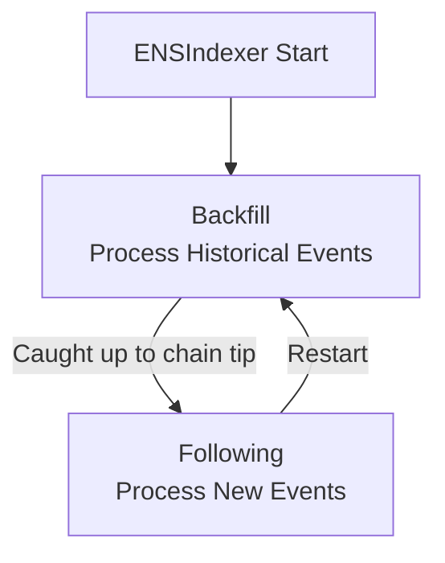
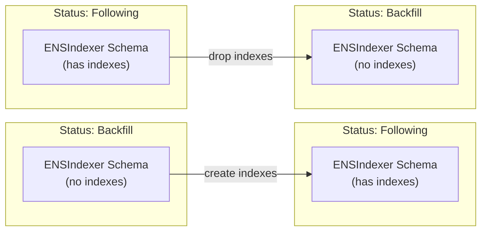

An [ENSIndexer instance](/ensdb/concepts/glossary#ensindexer-instance) processes onchain data in distinct phases. Understanding the [Indexing Status](/ensdb/concepts/glossary#indexing-status) lifecycle helps explain database behavior changes, particularly around index creation and deletion.

For terminology definitions, see the [Glossary](/ensdb/concepts/glossary).

## Indexing Status

An [ENSIndexer instance](/ensdb/concepts/glossary#ensindexer-instance) is always in one of two [Indexing Status](/ensdb/concepts/glossary#indexing-status) states:

| Status | Description |
|--------|-------------|
| **backfill** | Processing historical events from genesis to current block |
| **following** | Caught up to chain tip, processing new events as they occur |

The current status is tracked in the [ENSNode Metadata Table](/ensdb/concepts/glossary#ensnode-metadata-table).

## Lifecycle Flow



### Backfill Phase

During backfill, ENSIndexer processes all historical events from the beginning of the chain:

1. Scans blocks from genesis to current block
2. For each event matching the indexing filter:
   - Reads cached RPC from Ponder Schema (or fetches and caches)
   - Transforms data according to indexing logic
   - Writes to ENSIndexer Schema
3. Updates indexing status in ENSNode Metadata

**Database behavior during backfill:**

- **[Indexes](/ensdb/concepts/glossary#database-objects) are dropped** on [ENSIndexer Schema](/ensdb/concepts/glossary#ensindexer-schema) tables
- Reason: Writing millions of rows with indexes is significantly slower
- Trade-off: Queries are slower during backfill, but backfill completes faster

### Following Phase

Once caught up to the chain tip, an [ENSIndexer instance](/ensdb/concepts/glossary#ensindexer-instance) transitions to following:

1. Listens for new blocks
2. For each new event matching the indexing filter:
   - Reads cached RPC from [Ponder Schema](/ensdb/concepts/glossary#ponder-schema) (or fetches and caches)
   - Transforms data according to indexing logic
   - Writes to [ENSIndexer Schema](/ensdb/concepts/glossary#ensindexer-schema)
3. Updates [Indexing Status](/ensdb/concepts/glossary#indexing-status) in [ENSNode Metadata Table](/ensdb/concepts/glossary#ensnode-metadata-table)

**Database behavior during following:**

- **[Indexes](/ensdb/concepts/glossary#database-objects) are created** on [ENSIndexer Schema](/ensdb/concepts/glossary#ensindexer-schema) tables
- Reason: Read queries should be fast for serving API requests
- Trade-off: Writes are slightly slower, but queries are fast

## Index Management

The transition between Backfill and Following triggers index management:



### Why This Matters

**For query consumers:**
- Queries during Backfill will be slower (no indexes)
- Consider waiting for Following status before running heavy queries
- Check [Indexing Status](/ensdb/concepts/glossary#indexing-status) via [ENSNode Metadata Table](/ensdb/concepts/glossary#ensnode-metadata-table)

```sql
SELECT value->>'status' as status
FROM ensnode.metadata
WHERE ens_indexer_schema_name = 'ensindexer_abc123'
  AND key = 'ensindexer_indexing_status';
```

**For database operators:**
- Backfill generates high write load
- Following generates moderate write load + read load
- Plan resource allocation accordingly

## Restart Behavior

When an ENSIndexer instance restarts:

1. **If previously Following:**
   - Drops indexes on [ENSIndexer Schema](/ensdb/concepts/glossary#ensindexer-schema)
   - Enters Backfill to verify/repair any missed events
   - Re-creates indexes when caught up to Following

2. **Reasons for restart:**
   - Configuration change
   - Chain reorganization
   - Software update
   - Manual intervention

The [Ponder Schema](/ensdb/concepts/glossary#ponder-schema) RPC cache persists across restarts, reducing the cost of re-backfilling.

## Querying During Lifecycle

### Checking Status

```sql
SELECT 
  ens_indexer_schema_name,
  value->>'status' as status,
  value->>'progress' as progress
FROM ensnode.metadata
WHERE key = 'ensindexer_indexing_status';
```

### Safe Querying

For production queries, verify the [ENSIndexer instance](/ensdb/concepts/glossary#ensindexer-instance) is in Following [Indexing Status](/ensdb/concepts/glossary#indexing-status):

```sql
-- Only query if following
DO $$
DECLARE
  status text;
BEGIN
  SELECT value->>'status' INTO status
  FROM ensnode.metadata
  WHERE ens_indexer_schema_name = 'ensindexer_abc123'
  AND key = 'ensindexer_indexing_status';
  
  IF status != 'following' THEN
    RAISE EXCEPTION 'ENSIndexer not in following status';
  END IF;
END $$;

-- Now safe to run indexed queries
SELECT * FROM ensindexer_abc123.v1_domains WHERE ...;
```

## Related Concepts

- **[Glossary](/ensdb/concepts/glossary)** — [Indexing Status](/ensdb/concepts/glossary#indexing-status), [ENSIndexer Instance](/ensdb/concepts/glossary#ensindexer-instance) definitions
- **[Database Schemas](/ensdb/concepts/database-schemas)** — [ENSIndexer Schema](/ensdb/concepts/glossary#ensindexer-schema) structure
- **[Architecture](/ensdb/concepts/architecture)** — Data flow through ENSDb
