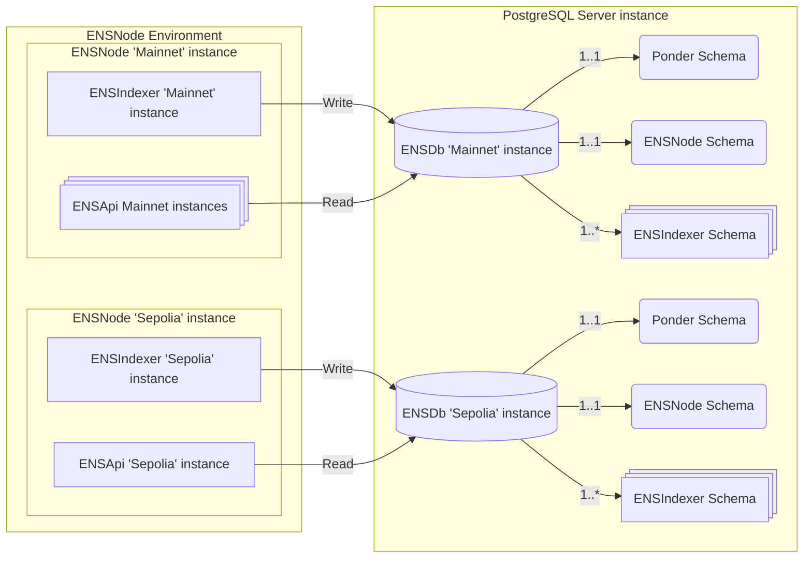
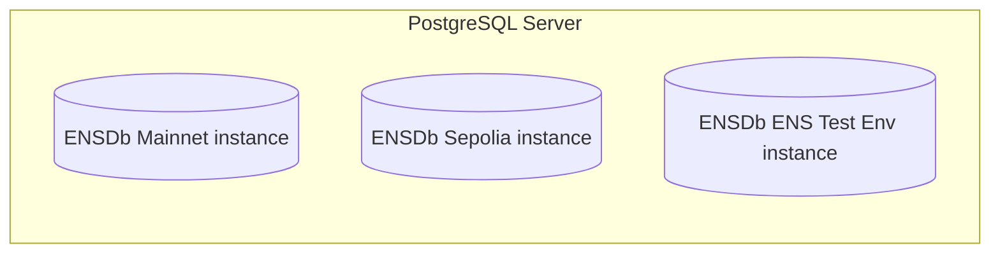

import { Aside } from '@astrojs/starlight/components';

ENSNode is the reference implementation of the [ENSDb standard](/ensdb/concepts/glossary#ensdb-standard), providing a complete ecosystem of tools and services for building with ENSDb. Each ENSNode instance includes:
- At least one [ENSDb instance](/ensdb/concepts/glossary#ensdb-instance) — The PostgreSQL database following the ENSDb standard.
- At least one [ENSIndexer instance](/ensdb/concepts/glossary#ensindexer-instance) — The reference ENSDb Writer implementation that writes data into the ENSDb instance.
- At least one [ENSApi instance](/ensdb/concepts/glossary#ensapi-instance) — The reference ENSDb Reader implementation that serves GraphQL and REST APIs.

<Aside type="tip" title="Build Your Own">
  You can build custom writers, readers, or both. The [ENSDb standard](/ensdb/concepts/glossary#ensdb-standard) is implementation-agnostic.
</Aside>

### Single PostgreSQL Server, Multiple ENSDb Instances

A single PostgreSQL server can serve multiple ENSDb instances for different ENS Namespaces. This allows you to have separate ENSDb instances based on your needs. For example:
- Your production environment can have a dedicated ENSDb instance for ENS data from the ENS Namespace "mainnet".
- Your staging environment can have a separate ENSDb instance for ENS data from the ENS Namespace "sepolia".
- Your local development environment can have its own ENSDb instance for testing with local or ephemeral data from the ENS Namespace "ens-test-env".

Each ENSDb instance is an independent database containing complete ENS data for its respective environment.
