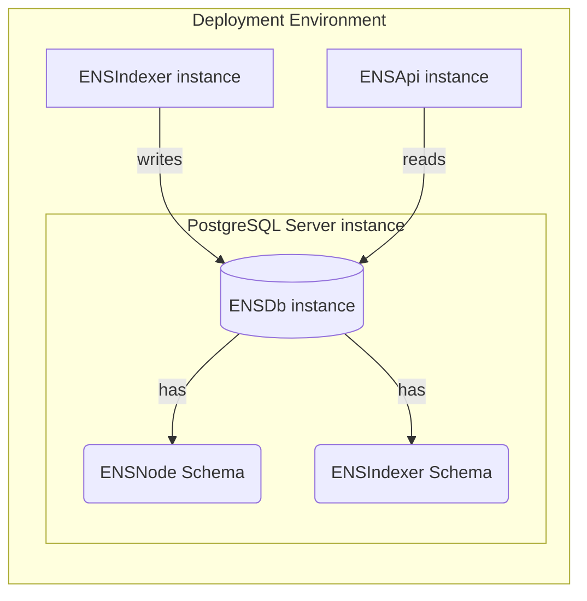

import { Aside } from '@astrojs/starlight/components';

ENSNode is the reference implementation of the [ENSDb standard](/ensdb/concepts/glossary#ensdb-standard), providing a complete ecosystem of tools and services for building with ENSDb.

The core implementation consists of three main components:
- An [ENSDb instance](/ensdb/concepts/glossary#ensdb-instance) — The PostgreSQL database following the ENSDb standard.
- An [ENSIndexer instance](/ensdb/concepts/glossary#ensindexer-instance) — The reference ENSDb Writer implementation that writes data into the ENSDb instance.
- An [ENSApi instance](/ensdb/concepts/glossary#ensapi-instance) — The reference ENSDb Reader implementation that serves GraphQL and REST APIs.

<Aside type="tip" title="Build Your Own">
  You can build custom ENSDb Writers, or ENSDb Readers. The [ENSDb standard](/ensdb/concepts/glossary#ensdb-standard) is implementation-agnostic.
</Aside>
