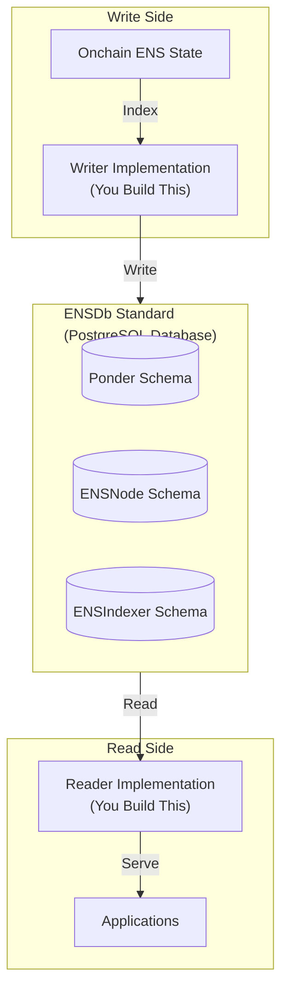
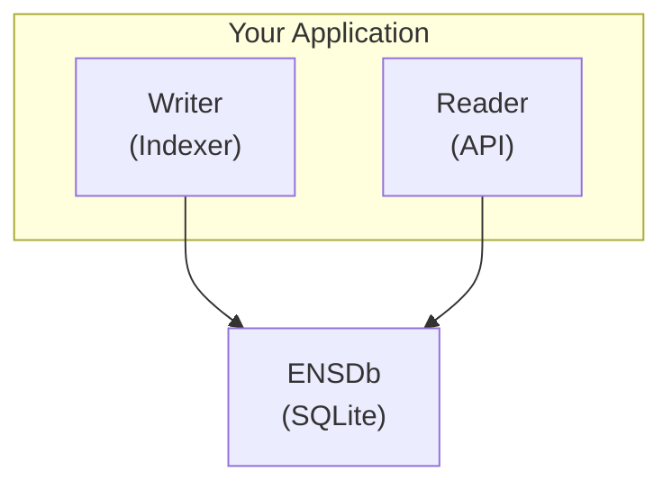
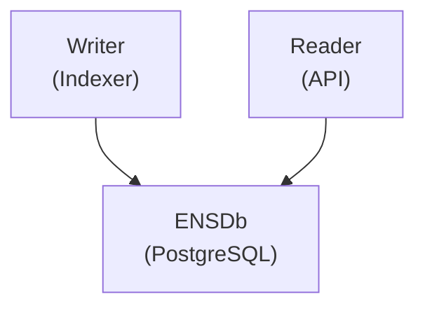
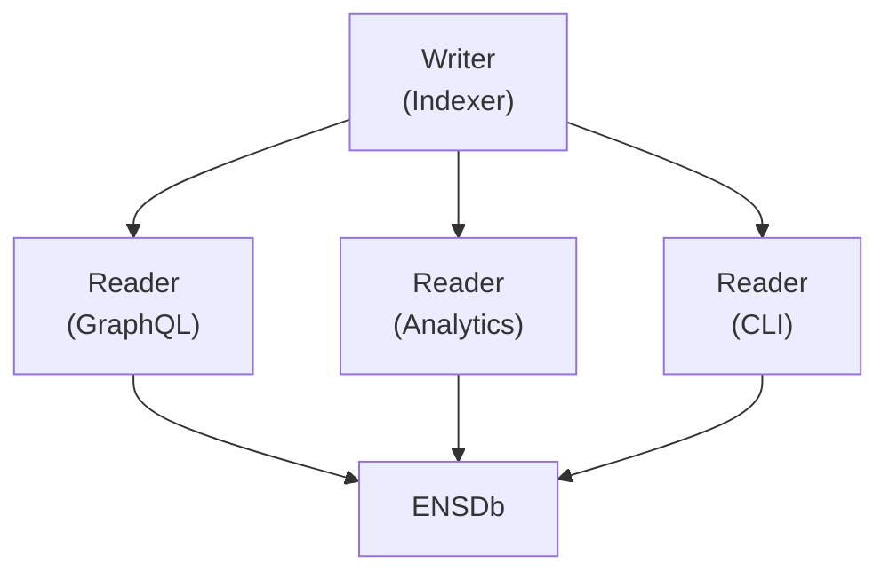
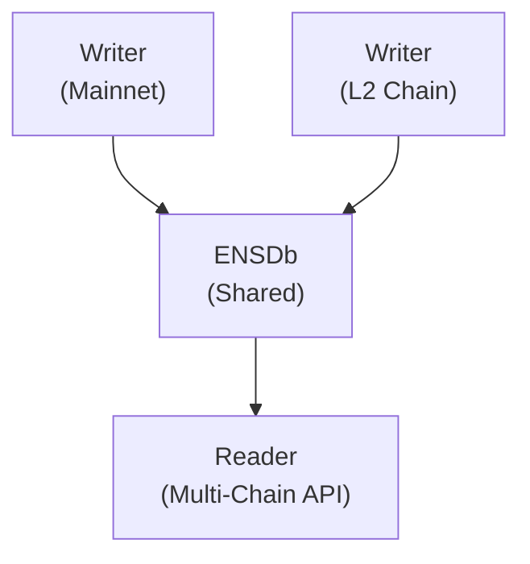

import { LinkCard, Aside, Card, CardGrid, Steps } from '@astrojs/starlight/components';

ENSDb is an **open standard** — anyone can build applications that write to or read from an ENSDb instance. This guide explains how to build custom integrations that follow the standard.

## The Writer/Reader Pattern

ENSDb follows a **bi-directional integration pattern**:

| Role | Responsibility | Example Implementations |
|------|----------------|------------------------|
| **Writer** | Indexes onchain ENS data and writes to ENSDb | ENSIndexer, Custom Indexers |
| **Reader** | Queries ENSDb and serves data to applications | ENSApi, Custom APIs, Dashboards |

<Aside type="tip">
You can build a **writer**, a **reader**, or both. The ENSDb standard ensures interoperability between any compliant implementations.
</Aside>

## Building a Writer

A writer is responsible for:
1. Reading onchain ENS events
2. Transforming data according to ENSDb schema definitions
3. Writing to an ENSIndexer Schema
4. Updating ENSNode Schema metadata

<LinkCard
  title="Build a Custom Writer"
  description="Learn how to build an indexer that writes to ENSDb following the standard schema definitions"
  href="/ensdb/integrations/writer/"
/>

### When to Build a Writer

- You need to index custom ENS-compatible contracts
- You want to index a new chain not covered by ENSIndexer
- You need specialized indexing logic for your use case
- You want to add custom tables to the ENSIndexer Schema

## Building a Reader

A reader is responsible for:
1. Querying ENSDb (ENSNode Schema for discovery, ENSIndexer Schema for data)
2. Transforming database results for your application
3. Serving data via your preferred interface (API, CLI, dashboard, etc.)

<LinkCard
  title="Build a Custom Reader"
  description="Learn how to query ENSDb and build applications that consume ENS data"
  href="/ensdb/integrations/reader/"
/>

### When to Build a Reader

- You need a specialized API for your application
- You're building analytics or dashboard tools
- You're creating a CLI for ENS operations
- You need real-time streaming of ENS state changes

## Schema Compliance

To be ENSDb-compliant, your implementation must follow the standard schema definitions:

<CardGrid>
<Card title="ENSNode Schema" icon="document">
Required metadata structure for tracking ENSIndexer instances
</Card>
<Card title="ENSIndexer Schema" icon="document">
Modular schema with 5 sub-schemas: ensv2, protocol-acceleration, registrars, subgraph, tokenscope
</Card>
<Card title="Ponder Schema" icon="document">
Shared RPC cache structure (if using Ponder-based indexing)
</Card>
</CardGrid>

See [Database Schemas](/ensdb/concepts/database-schemas/) for complete schema documentation.

## Language Support

You can build ENSDb integrations in **any programming language** with a PostgreSQL driver:

| Language | Popular Drivers | Use Cases |
|----------|-----------------|-----------|
| **TypeScript** | `pg`, `drizzle-orm`, `kysely` | APIs, dashboards, web apps |
| **Python** | `psycopg2`, `asyncpg`, `sqlalchemy` | Analytics, ML, data pipelines |
| **Go** | `pgx`, `database/sql`, `sqlx` | High-performance services, CLIs |
| **Rust** | `tokio-postgres`, `sqlx`, `diesel` | Systems programming, performance |
| **Java** | `JDBC`, `jOOQ`, `Hibernate` | Enterprise applications |
| **Ruby** | `pg`, `ActiveRecord` | Web applications |

## SDKs and Tools

### Official SDK

The [ENSDb SDK](/ensdb/usage/ensdb-sdk/) (`@ensnode/ensdb-sdk`) provides:
- Schema definitions (Drizzle ORM)
- TypeScript types for all tables
- Reader/Writer client classes
- Schema validation utilities

### Building Without the SDK

You can build ENSDb integrations without the TypeScript SDK:

1. **Study the schema** — Use [Database Schemas](/ensdb/concepts/database-schemas/) as reference
2. **Implement in your language** — Create equivalent schema definitions
3. **Follow the conventions** — Use the same table names, column types, and relationships
4. **Test for compatibility** — Verify your implementation works with existing readers/writers

## Integration Architecture Patterns

### Pattern 1: Co-located Writer and Reader

Writer and reader run in the same process, sharing a database connection:

**Best for**: Local development, testing, embedded applications

### Pattern 2: Separate Writer and Reader

Writer and reader are separate processes connecting to a shared ENSDb:

**Best for**: Production deployments, microservices, scaled architectures

### Pattern 3: Multiple Readers

One writer, multiple specialized readers:

**Best for**: Multi-team organizations, diverse use cases

### Pattern 4: Chain-Specific Writers

Multiple writers indexing different chains, one shared ENSDb:

**Best for**: Multi-chain ENS deployments, aggregated APIs

## Compliance Checklist

Before deploying your integration, verify:

### For Writers

- [ ] Creates ENSIndexer Schema with dynamic name
- [ ] Creates/updates ENSNode Schema metadata table
- [ ] Follows ENSIndexer Schema table definitions (all 5 sub-schemas)
- [ ] Updates indexing status in ENSNode metadata during operation
- [ ] Handles backfill vs following states appropriately (indexes)
- [ ] Supports schema versioning

### For Readers

- [ ] Queries ENSNode Schema for schema discovery
- [ ] Reads from ENSIndexer Schema for data queries
- [ ] Handles multiple ENSIndexer Schemas (multi-tenancy)
- [ ] Respects indexing status (warns if querying during backfill)
- [ ] Validates schema version compatibility

## Next Steps

<Steps>
1. **Understand the schemas**
   
   Read [Database Schemas](/ensdb/concepts/database-schemas/) to understand the complete data model.

2. **Choose your language**
   
   Pick a language with good PostgreSQL support for your use case.

3. **Build a reader first**
   
   Start by querying an existing ENSDb to understand the data model.

4. **Consider the SDK**
   
   For TypeScript, use `@ensnode/ensdb-sdk`. For other languages, port the schema definitions.

5. **Test for compatibility**
   
   Ensure your implementation works with existing ENSDb tools.
</Steps>

## Getting Help

- **[GitHub Discussions](https://github.com/namehash/ensnode/discussions)** — Ask questions about building integrations
- **[Discord](https://discord.gg/ensnode)** — Chat with the community
- **[Issue Tracker](https://github.com/namehash/ensnode/issues)** — Report bugs or request features

## Related Documentation

<LinkCard
  title="Database Schemas"
  description="Complete schema reference for all ENSDb tables"
  href="/ensdb/concepts/database-schemas/"
/>

<LinkCard
  title="Use Cases"
  description="Real-world examples of what you can build with ENSDb"
  href="/ensdb/use-cases/"
/>

<LinkCard
  title="ENSIndexer Contributing"
  description="Learn how ENSIndexer is built (reference writer implementation)"
  href="/ensindexer/contributing/"
/>
