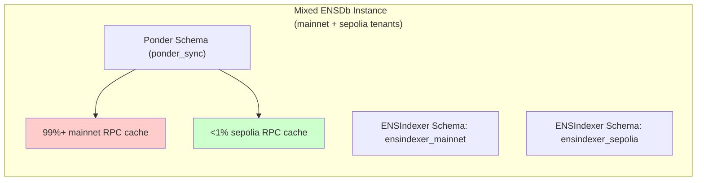
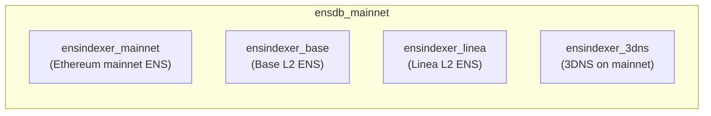
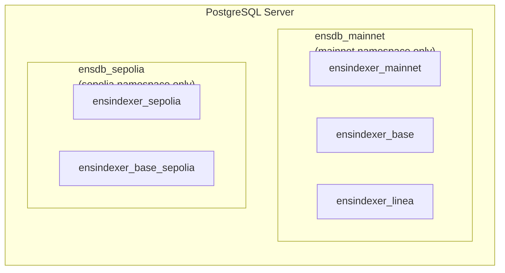
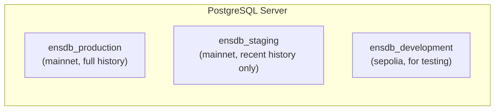

import { Aside, Card, CardGrid } from '@astrojs/starlight/components';

This guide covers operational considerations for running ENSNode in production, with a focus on cost optimization, resource isolation, and efficient deployment strategies.

## Multitenancy and Resource Sharing

An ENSDb instance is **multi-tenant** by design — it can store data from multiple [ENSIndexer instances](/ensdb/concepts/glossary#ensindexer-instance) (tenants) that share common infrastructure while maintaining data isolation.

### What Tenants Share

| Resource | Sharing Model | Purpose |
|----------|---------------|---------|
| Ponder Schema (`ponder_sync`) | Shared across all tenants | RPC cache to reduce redundant blockchain calls |
| ENSNode Schema (`ensnode`) | Shared across all tenants | Metadata tracking for all connected indexers |
| PostgreSQL Server Resources | Shared (CPU, memory, I/O) | Database engine and connection handling |

### What Tenants Own

Each tenant (ENSIndexer instance) has:
- **Dedicated ENSIndexer Schema** — fully isolated data namespace (e.g., `ensindexer_mainnet`, `ensindexer_base`)
- **Independent indexing lifecycle** — can start, stop, or restart without affecting other tenants
- **Own configuration and status** — tracked separately in the ENSNode Metadata Table

<Aside type="tip" title="Cost Efficiency">
Multitenancy reduces costs by sharing the RPC cache across all tenants. When one indexer fetches a block or contract state, subsequent indexers requesting the same data use the cached result—eliminating redundant RPC calls.
</Aside>

## ENS Namespace Isolation

The most critical operational decision is how to handle [ENS Namespaces](/ensindexer/usage/ens-namespaces). An ENS Namespace (like "mainnet" or "sepolia") defines which chains an ENSIndexer instance indexes.

### The Problem: Mixed Namespaces

When a single ENSDb instance hosts ENSIndexer instances for **different namespaces** (e.g., some indexing "mainnet", others indexing "sepolia"):

1. **The Ponder Schema caches RPC data for ALL indexed chains**
2. **Mainnet data dominates the cache** — due to significantly more blocks, events, and contract state
3. **Testnet data becomes a tiny fraction** — even if you're primarily interested in testnets



### The Solution: Namespace-Per-Instance

For lean, cost-effective testnet operations, use **separate ENSDb instances** per ENS Namespace:

| ENSDb Instance | ENS Namespace | Tenants | Ponder Schema Contents |
|---------------|---------------|---------|----------------------|
| `ensdb_mainnet` | mainnet | Mainnet indexers | Mainnet chains only |
| `ensdb_sepolia` | sepolia | Sepolia indexers | Testnet chains only |

<Aside type="caution" title="Cost Impact">
A mixed-namespace ENSDb instance can have a Ponder Schema **hundreds of gigabytes** larger than a testnet-only instance. This affects:
- Snapshot size and transfer time
- Storage costs
- Backup/restore duration
- Memory pressure for cache operations
</Aside>

## Cost Optimization Strategies

### 1. Dedicated Testnet Instances

If you primarily need testnet data, deploy a dedicated `ensdb_sepolia` instance:

```bash
# Separate PostgreSQL databases
psql postgresql://localhost:5432/ensdb_mainnet  # Production
psql postgresql://localhost:5432/ensdb_sepolia  # Testing/development
```

**Benefits:**
- **Smaller snapshots** — tens of GB instead of hundreds
- **Faster restore** — minutes instead of hours
- **Lower storage costs** — no mainnet bloat
- **Reusable RPC cache** — when you restore, the testnet cache is already primed

### 2. Snapshot Strategy

Take **namespace-specific ENSDb snapshots** for efficient backup and restore:

| Snapshot Type | Contents | Use Case |
|--------------|----------|----------|
| `ensdb_mainnet_full` | Complete mainnet ENSDb | Production deployments |
| `ensdb_sepolia_full` | Complete sepolia ENSDb | Development, CI/CD, testing |

<Aside type="tip" title="RPC Credit Savings">
Restoring from a snapshot with a primed Ponder Schema can save **hundreds to thousands of dollars** in RPC credits. Without the cache, re-indexing requires re-fetching all historical blocks, events, and contract state from RPC nodes.
</Aside>

### 3. Development Environment

For local development or CI pipelines:

1. Download the latest `ensdb_sepolia` snapshot
2. Import into a local PostgreSQL instance
3. Connect ENSApi to query testnet data

```bash
# Download snapshot (URL is illustrative — service not yet available)
# curl -O https://snapshots.ensnode.io/ensdb_sepolia_latest.sql.gz

# Restore to local database
# gunzip < ensdb_sepolia_latest.sql.gz | psql postgresql://localhost:5432/ensdb_sepolia

# Start ENSApi pointing to the restored ENSDb
# DATABASE_URL=postgresql://localhost:5432/ensdb_sepolia pnpm start
```

## Deployment Patterns

### Pattern 1: Single-Instance Multi-Tenant (Production)

One ENSDb instance hosting multiple mainnet chain indexers:



**When to use:** Production environments indexing multiple chains within the same ENS Namespace.

### Pattern 2: Namespace-Isolated Instances (Recommended)

Separate ENSDb instances per ENS Namespace:



**When to use:** When you need efficient testnet deployments or want precise control over snapshot boundaries.

### Pattern 3: Environment-Based Isolation

Separate ENSDb instances per deployment environment:



**When to use:** When different environments have different data freshness requirements.

## Backup and Restore Procedures

### Taking a Snapshot

A complete ENSDb snapshot includes all schemas:

```bash
# Full database dump (all schemas)
pg_dump -Fc postgresql://host:5432/ensdb_mainnet > ensdb_mainnet_$(date +%Y%m%d).dump

# Verify size
ls -lh ensdb_mainnet_*.dump
```

### Restoring from Snapshot

```bash
# Create fresh database
createdb postgresql://host:5432/ensdb_restored

# Restore from dump
pg_restore -d postgresql://host:5432/ensdb_restored ensdb_mainnet_20240115.dump

# Verify tenants are present
psql postgresql://host:5432/ensdb_restored -c "SELECT DISTINCT ens_indexer_schema_name FROM ensnode.metadata;"
```

### Selective Restore (Advanced)

If you only need specific tenants from a snapshot, you can restore specific schemas:

```bash
# Restore only specific ENSIndexer Schema and required system schemas
pg_restore \
  --schema=ponder_sync \
  --schema=ensnode \
  --schema=ensindexer_base \
  -d postgresql://host:5432/ensdb_base_only \
  ensdb_mainnet_20240115.dump
```

<Aside type="note">
Selective restore requires careful handling of schema dependencies. The Ponder Schema and ENSNode Schema must always be present for the ENSDb instance to function correctly.
</Aside>

## Monitoring and Alerts

### Key Metrics

| Metric | Source | Alert Threshold |
|--------|--------|-----------------|
| Ponder Schema size | `pg_total_relation_size('ponder_sync.*')` | > 80% of disk |
| ENSIndexer lag | `ensnode.metadata` ensindexer_indexing_status | > 100 blocks behind |
| Active tenants | `COUNT(DISTINCT ens_indexer_schema_name)` | Unexpected drop |
| Disk utilization | PostgreSQL system stats | > 85% |

### Health Check Query

```sql
-- Check all tenant statuses in an ENSDb instance
SELECT 
    ens_indexer_schema_name,
    value->>'status' as status,
    value->>'lastSyncedBlock' as last_block,
    value->>'chainId' as chain_id
FROM ensnode.metadata
WHERE key = 'ensindexer_indexing_status';
```

## Troubleshooting

### Issue: ENSDb Instance Growing Too Large

**Symptoms:** Disk usage increasing rapidly, slow queries, backup failures.

**Diagnosis:**
```sql
-- Check Ponder Schema size by table
SELECT 
    schemaname,
    tablename,
    pg_size_pretty(pg_total_relation_size(schemaname||'.'||tablename)) as size
FROM pg_tables
WHERE schemaname = 'ponder_sync'
ORDER BY pg_total_relation_size(schemaname||'.'||tablename) DESC;
```

**Solutions:**
1. **Separate namespaces** — Move testnet indexers to a dedicated `ensdb_sepolia` instance
2. **Verify tenant configurations** — Ensure all tenants are intentionally included
3. **Consider schema-specific restore** — If some tenants are no longer needed

### Issue: High RPC Costs Despite Cache

**Symptoms:** RPC usage higher than expected, cache hit rate low.

**Possible causes:**
- Mixed namespaces diluting cache effectiveness
- Too many ENSDb instances with isolated Ponder Schemas (no sharing)
- Infrequent queries causing cache eviction

### Issue: Slow Indexer Restart

**Symptoms:** Indexer takes hours to resume after restart.

**Diagnosis:**
```sql
-- Check if Ponder Schema has required cache entries
SELECT COUNT(*) FROM ponder_sync.blocks WHERE chain_id = 1;
```

**Solution:** Ensure you're restoring from a snapshot with a primed Ponder Schema, not starting from scratch.

## Best Practices Summary

1. **Isolate by ENS Namespace** — Separate `ensdb_mainnet` and `ensdb_sepolia` instances
2. **Share within Namespace** — Use multitenancy for multiple chains in the same namespace
3. **Snapshot strategically** — Take namespace-specific snapshots for efficient restore
4. **Monitor Ponder Schema size** — It's your primary indicator of resource usage
5. **Document tenant configurations** — Know which ENSIndexer instances are writing to each ENSDb instance

## Related Documentation

<CardGrid>
<Card title="Database Schemas" icon="document">
Deep dive into Ponder Schema, ENSNode Schema, and ENSIndexer Schemas
</Card>
<Card title="Architecture" icon="seti:graphql">
How multitenancy works and how schemas relate
</Card>
<Card title="ENS Namespaces" icon="seti:settings">
How ENSIndexer uses namespaces to determine which chains to index
</Card>
</CardGrid>
