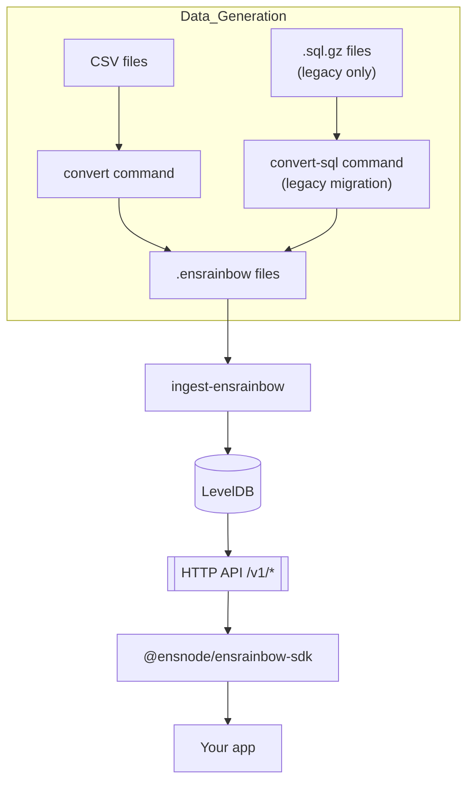

import { LinkCard } from '@astrojs/starlight/components';

ENSRainbow consists of four primary layers working together to "heal" unknown labels:

1. **Data Generation & Conversion** – CSV files are converted to the modern `.ensrainbow` format (SQL conversion is available only for migrating legacy ENS Subgraph data).
2. **Data Ingestion** – the `.ensrainbow` files are ingested into a LevelDB database using the `ingest-ensrainbow` CLI.
3. **HTTP API Service** – state in the database is exposed through a lightweight HTTP API.
4. **Client Integration** – applications call the API directly or via the TypeScript SDK.

:::tip[Why this matters]
Understanding the flow helps you pick the right starting point—whether you only need the hosted API, want to ingest your own data, or plan to contribute to the core.
::: 
