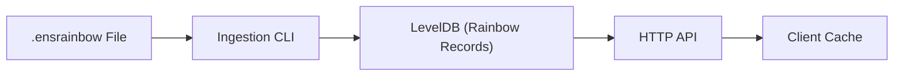

ENSRainbow stores its rainbow table in a **LevelDB** database. The schema is intentionally simple and append-only:

## Database Schema

| Component | Encoding | Description |
|-----------|----------|-------------|
| **Record Key** | 32-byte raw `labelhash` (no `0x` prefix) | Guarantees optimal prefix lookups & avoids hex-string parsing overhead. |
| **Record Value** | UTF-8 string formatted as `{labelSetVersion}:{label}` | This is produced by [`buildEncodedVersionedRainbowRecord`](https://github.com/ensdomains/ensnode/blob/main/apps/ensrainbow/src/lib/rainbow-record.ts). |
| **System Keys** | Byte arrays _not_ length 32 prefixed with `0xff…` | Hold metadata such as schema version, ingestion status, precalculated count, etc. |

## Versioned Rainbow Record

```ts
interface VersionedRainbowRecord {
  label: string;          // original label
  labelSetVersion: number;// version it belongs to
}
// Encoded on disk as: "{labelSetVersion}:{label}"
```

Storing the version alongside the label allows **incremental snapshots** to coexist. This makes historical healing and deterministic client-side caching straightforward.

## Metadata Fields

The database keeps a handful of **system keys** that do not clash with labelhashes (their length ≠ 32 bytes):

* `0xff 0xff 0xff 0xff` → precalculated record count
* `0xff 0xff 0xff 0xfe` → ingestion status (`unstarted`/`unfinished`/`finished`)
* `0xff 0xff 0xff 0xfd` → database schema version (currently `3`)
* `0xff 0xff 0xff 0xfc` → highest label set version
* `0xff 0xff 0xff 0xfb` → label set id

## ENSRainbow File Format

A **`.ensrainbow` file** is the _on-disk representation_ of a label set. It is a compressed, append-only collection with the following structure:

### 1. Header (fixed-size)
- `labelSetId` – ASCII, 1-50 chars
- `labelSetVersion` – uint32 LE

### 2. Body (streamed)
Sequence of `labelhash → label` pairs.

### File Naming Convention

The filename convention mirrors the header so humans can eyeball it quickly:

```text
subgraph_0.ensrainbow     # labelSetId = "subgraph", version = 0
subgraph_1.ensrainbow     # next version with new labelhash-to-label mappings added
```

## Ingestion Process

During **ingestion** ENSRainbow:

1. Reads the header first
2. Validates it against any existing database metadata
3. Streams each pair, converting the plain _label_ into an **encoded versioned rainbow record** (`{labelSetVersion}:{label}`)
4. Writes it to LevelDB

Importing `subgraph_1.ensrainbow` will increment `SYSTEM_KEY_HIGHEST_LABEL_SET_VERSION` to `1` and mark the previous snapshot as superseded, while still allowing clients pinned to version `0` to heal deterministically.

## Data Flow Overview



## Related Documentation

- **[Glossary](/ensrainbow/concepts/glossary)** - Key terms like System Key, Ingestion, etc.
- **[Label Sets & Versioning](/ensrainbow/concepts/label-sets-and-versioning)** - Understanding the versioning system
- **[TypeScript Interfaces](/ensrainbow/concepts/typescript-interfaces)** - Type definitions for working with the data 
