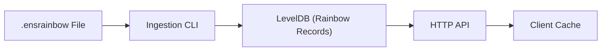

import { Callout } from '@astrojs/starlight/components';

# Introduction

This page defines the **core terminology** used throughout the ENSRainbow code-base and documentation, and explains **how the data is organised** inside an ENSRainbow instance.  Skim through it before diving into the code – it will save you a lot of context-switching later 🚀.

_If you notice an unfamiliar word elsewhere in the docs, come back to this page – it is probably defined here._

## Glossary

| Term | Definition | Example |
|------|------------|---------|
| **Label** | A single component of an ENS name (characters between two dots). Can contain **any** valid UTF-8 string – it may not be ENS-normalised. | `vitalik`, `😺`, `example.eth` has labels `example` & `eth` |
| **Labelhash** | `keccak256` hash of the UTF-8 bytes of a label (no pre-normalisation), represented as a **0x-prefixed 64-digit lowercase hex** string (32 bytes). Used on-chain by the ENS registry. | `0xaf2caa…03cc` |
| **Heal** | The act of converting a _labelhash_ back to its original _label_ via a rainbow table lookup. | `heal('0xaf2c…') → 'vitalik'` |
| **Rainbow Record** | An entry mapping a `labelhash` ➜ `label`. Persisted as a LevelDB key (labelhash bytes) and UTF-8 value (_see Data Model_). | – |
| **Label Set** | A logical collection of rainbow records that share a common **source** and **versioning** scheme (e.g. subgraph v1). Identified by `labelSetId` & `labelSetVersion`. | id: `subgraph`, version: `0` |
| **LabelSetId** | String (1-50 chars) consisting of lowercase letters & dashes that names a label set. | `subgraph`, `discovery-a` |
| **LabelSetVersion** | Non-negative integer that monotonically increases when the underlying data source is re-exported. Enables deterministic healing across time. | `0`, `1`, `2` |
| **Healable Count** | Total number of labels that can currently be healed by the running server. Exposed via `/count`. | `7 892 001` |
| **Status Code** | High-level outcome of an API call – either `success` or `error`. | – |
| **Error Code** | HTTP-style numeric code describing the error (`400`, `404`, `500`). | – |
| **Rainbow Table** | The pre-computed set of all `labelhash → label` pairs used for healing. | – |
| **Ingestion** | One-off process that streams a `.ensrainbow` snapshot into LevelDB. | `pnpm run ingest subgraph_0.ensrainbow` |
| **System Key** | Special LevelDB key (length ≠ 32 bytes) storing metadata such as schema version, label set id, etc. | `0xff 0xff 0xff 0xfd` |
| **ENS Normalization** | The ENSIP-15 canonicalisation process; ENSRainbow stores labels **as-is**, even if not normalised. | – |

## Why Label Sets & Versions?

A **label set** is analogous to a _dataset snapshot_.  Every time the upstream data (e.g. an on-chain subgraph export) changes, we mint a new **LabelSetVersion** so that:

1. **Deterministic Results** – Clients that pin _version `N`_ are guaranteed to get the _exact same_ heal response today, tomorrow, and two years from now.
2. **Safe Upgrades** – The server can ingest and start serving a newer version (`N+1`) _in parallel_ without breaking existing clients.
3. **Historical Audits** – Researchers can spin up an ENSRainbow instance at any past version to reproduce historical state.
4. **Multiple Sources** – Distinct `labelSetId`s (e.g. `subgraph`, `discovery-a`) allow side-by-side datasets with different coverage or curation strategies.

In short, versions are the contract that keeps **client caches**, **API responses**, and **database state** in sync across time.

## Data Model

ENSRainbow stores its rainbow table in a **LevelDB** database.  The schema is intentionally simple and append-only:

| Component | Encoding | Description |
|-----------|----------|-------------|
| **Record Key** | 32-byte raw `labelhash` (no `0x` prefix) | Guarantees optimal prefix lookups & avoids hex-string parsing overhead. |
| **Record Value** | UTF-8 string formatted as `{labelSetVersion}:{label}` | This is produced by [`buildEncodedVersionedRainbowRecord`](https://github.com/ensdomains/ensnode/blob/main/apps/ensrainbow/src/lib/rainbow-record.ts). |
| **System Keys** | Byte arrays _not_ length 32 prefixed with `0xff…` | Hold metadata such as schema version, ingestion status, precalculated count, etc. |

### Versioned Rainbow Record

```ts
interface VersionedRainbowRecord {
  label: string;          // original label
  labelSetVersion: number;// version it belongs to
}
// Encoded on disk as: "{labelSetVersion}:{label}"
```

Storing the version alongside the label allows **multiple snapshots** of the same label to coexist.  This makes historical healing and deterministic client-side caching straightforward.

### Metadata Fields

The database keeps a handful of **system keys** that do not clash with labelhashes (their length ≠ 32 bytes):

* `0xff 0xff 0xff 0xff` → precalculated record count
* `0xff 0xff 0xff 0xfe` → ingestion status (`unstarted`/`unfinished`/`finished`)
* `0xff 0xff 0xff 0xfd` → schema version (currently `3`)
* `0xff 0xff 0xff 0xfc` → highest label set version
* `0xff 0xff 0xff 0xfb` → label set id

A **`.ensrainbow` file** is the _on-disk representation_ of a label set.  It is a compressed, append-only collection with the following structure:

1. **Header (fixed-size)**  
   • `labelSetId` – ASCII, 1-50 chars  
   • `labelSetVersion` – uint32 LE  
   The header lets the ingest process know _where_ the snapshot belongs in the global version graph.
2. **Body (streamed)** – sequence of `labelhash → label` pairs.

During **ingestion** ENSRainbow reads the header first, validates it against any existing database metadata, then streams each pair, converting the plain _label_ into an **encoded versioned rainbow record** (`{labelSetVersion}:{label}`) before writing it to LevelDB.

The filename convention mirrors the header so humans can eyeball it quickly, e.g.:

```text
subgraph_0.ensrainbow     # labelSetId = "subgraph", version = 0
subgraph_1.ensrainbow     # same dataset after a re-export
```

Importing `subgraph_1.ensrainbow` will increment `SYSTEM_KEY_HIGHEST_LABEL_SET_VERSION` to `1` and mark the previous snapshot as superseded, while still allowing clients pinned to version `0` to heal deterministically.

### Data Flow Overview



## Server & Client Label Set Objects

ENSRainbow's TypeScript APIs expose two companion types that describe **which label sets are available (server-side) or expected (client-side)**.

### `EnsRainbowServerLabelSet`

Returned by `GET /version` and stored in database metadata:

```ts
interface EnsRainbowServerLabelSet {
  labelSetId: string;          // active dataset id (e.g. "subgraph")
  highestLabelSetVersion: number; // newest version the server has ingested
}
```

* `labelSetId` identifies **which dataset** the server is currently serving.
* `highestLabelSetVersion` is the **latest snapshot** available. Older versions may still reside on disk, but the server will never return labels from a version _greater_ than this value.

### `EnsRainbowClientLabelSet`

Provided when constructing `new EnsRainbowApiClient({ labelSet: … })` to pin client expectations:

```ts
interface EnsRainbowClientLabelSet {
  labelSetId?: string;    // optional – require a particular dataset
  labelSetVersion?: number; // optional – maximum snapshot version accepted
}
```

Guidelines:

1. **Neither field** → accept any dataset & always use the latest version (default behaviour).
2. **Only `labelSetId`** → insist on a specific dataset but stay on its latest snapshot.
3. **Both fields** → lock the client to an exact snapshot. The SDK validates the server supports at least this version and filters out labels with a higher version.

This handshake ensures both parties interpret every heal operation against the **same logical snapshot**, enabling deterministic caching and reproducible results across time.

## API Surface

### Endpoint Summary

| Endpoint | Purpose | Key Types Returned |
|----------|---------|--------------------|
| `GET /heal/{labelhash}` | Heal a single labelhash. | `HealSuccess`, `HealError` |
| `GET /count` | Current healable label count. | `CountSuccess`, `CountServerError` |
| `GET /health` | Liveness probe for orchestration. | `{ status: "ok" }` |
| `GET /version` | Server & database schema info plus `EnsRainbowServerLabelSet`. | `VersionInfo` |

<Callout type="tip">
Pin `labelSetVersion` in your client if you need **deterministic results** across time.
</Callout>

### Example Requests

```bash
# Heal (success)
curl -s https://api.ensrainbow.io/heal/0xaf2caa1c2ca1d027f1ac823b529d0a67cd144264b2789fa2ea4d63a67c7103cc | jq
```

```json
{
  "status": "success",
  "label": "vitalik"
}
```

```bash
# Heal (not found)
curl -s https://api.ensrainbow.io/heal/0x000000000000000000000000000000000000000000000000000000000000dead | jq
```

```json
{
  "status": "error",
  "error": "Label not found",
  "errorCode": 404
}
```

```bash
# Count
curl -s https://api.ensrainbow.io/count | jq
```

```json
{
  "status": "success",
  "count": 7892001,
  "timestamp": "2024-05-03T12:34:56Z"
}
```

```bash
# Version
curl -s https://api.ensrainbow.io/version | jq
```

```json
{
  "status": "success",
  "versionInfo": {
    "version": "1.3.0",
    "dbSchemaVersion": 3,
    "labelSet": {
      "labelSetId": "subgraph",
      "highestLabelSetVersion": 1
    }
  }
}
```

## Next Steps

* Try the [Quickstart](/ensrainbow/) to spin up a local server.
* Learn how to [ingest](https://github.com/ensdomains/ensnode/tree/main/apps/ensrainbow#ingestion) new label sets.
* Explore the [Client SDK](/ensrainbow/usage/client-sdk/) for type-safe queries. 
